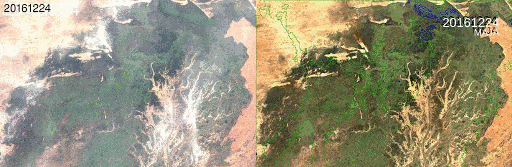

Main Skills
-----------

{{site.data.str.pda}} has a staff of nearly 40 engineers and more than 27 years of experience in the field of image processing, and therefore has a very good grasp of its challenges and its customers' expectations.
CS has strong experience in image processing, whether in terms of expertise in imaging or in the development of processing chains.

Imaging expertise is valued on a daily basis in the definition of treatments, chain prototyping or through the realization of numerous R&T studies for the CNES. 

Expertise in remote sensing and satellite image processing:
* Image and signal processing;
* Radiometric expertise;
* Atmospheric corrections.

 

Detailed activities
-------------------

The activities of the PDA department in terms of remote sensing and image processing are mainly grouped in the following themes:
* Measurement physics
* Sensor calibration
* Radiative transfer
* Atmosphere and cloud correction
* Analysis of the quality of geometric and radiometric images
* Geometry and image processing: Stereo reconstruction activities (e.g. [S2P](product-s2p.html), [CO3D](project-cnes-co3d-en.html)) and data simulation
* CALVAL (ex: S2-MPC Sentinel-2 Mission Performance Centre)
* Creation of value-added products (e.g. KALIDEOS)
* Open source libraries (e.g. [ORFEO Toolbox](product-orfeotb.html), SNAP, [Rugged](https://www.orekit.org/rugged/)...)
* Optical (ex: Pleiades, SPOT6/7, Pleaides Neo, FalconEye Sentinel 2/3, CO3D, ),
* Radar (ex: Sentinel 1,...)
* Altimetry data (ex: SWOT).
