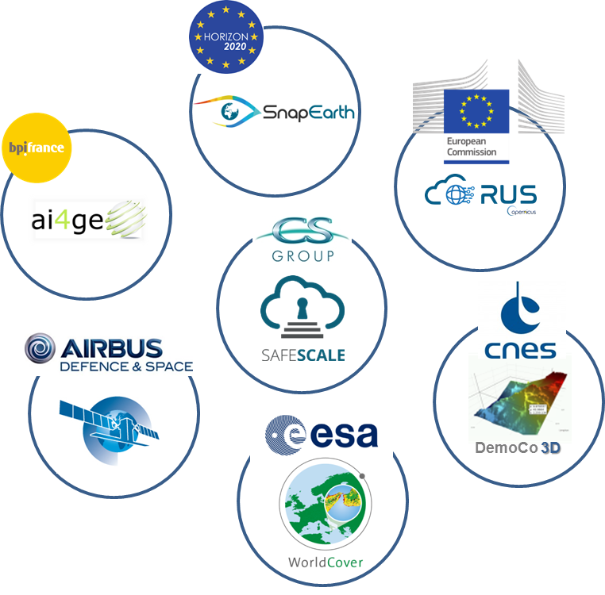
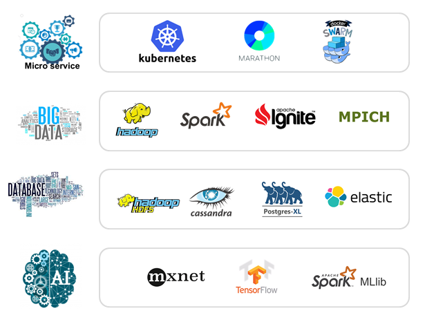

Main Skills
-----------

{{site.data.str.pda}} brings its expertise for design, development with Big Data and Cloud technologies.
In order to meet the increasingly massive needs for data exploitation (satellites & others), it is essential to have appropriate computer environments and digital tools.
The objective of {{site.data.str.pda}} is to offer a variety of Big Data frameworks (and/or on-demand applications) adapted to the needs without having to manage the allocation of the necessary IT resources.

 

Detailed activities
-------------------

 

These scalable work environments have been successfully deployed and have made it possible to:
* Benefit from the infrastructures best adapted to the needs and budget
* Benefit from generic access platforms and services to manage & process information 
* Effectively deliver value-added results with Big Data & AI solutions 

SafeScale&#153;
---------

Thanks to the know-how of the Big Data competence center, {{site.data.str.pda}} deploys an innovative solution, combining the latest technologies from the world of Big Data and DevOps and compatible with any cloud provider.
This solution, called [SafeScale&#153;](product-safescale.html), currently under development at {{site.data.str.cs}}, has already been successfully deployed in large-scale production on the [Copernicus RUS service](project-ec-rus-en.html), and is now being deployed for the [CO3D](project-cnes-co3d-en.html) processing chain demonstration project, the [BIDSRAF](project-esa-bidsraf-en.html) project and the [S1 PDGS](project-esa-s1-pdgs-en.html) project. The [WordlCover](project-esa-worldcover-en.html), SnapEarth and AI4GEO projects will also benefit from this solution.