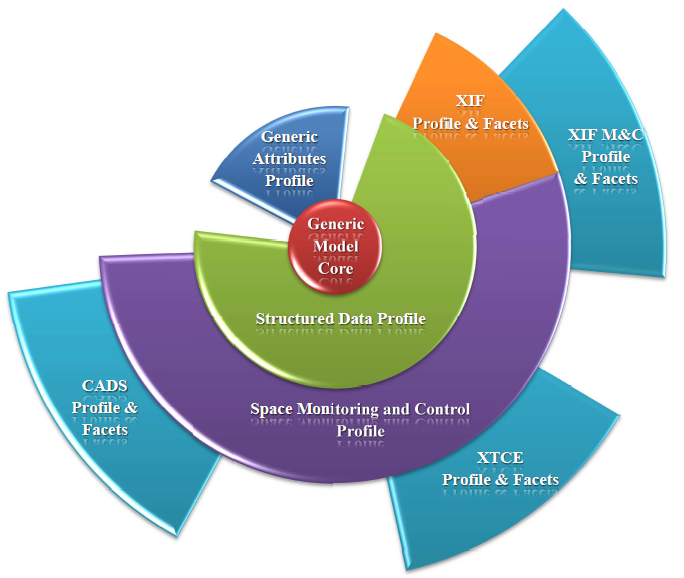

Overview
--------

This project has been motivated by performance issues, encountered while using the BEST toolkit with big-sized models.
Currently, BEST is also limited by the fact that the XIF format is hard-written in the toolkit’s very core. This makes extending it quite a challenge.
For these reasons, CNES wished to define a new internal model definition, which the new BEST tools suite could be based upon.

In its latest form, the project aims at providing a new generic modeler, addressing various formats in a single model, and with reasonable performances for big models (>500 Mo in XML form) even on a standard PC configuration.
This modeler is no longer based on a particular format, but on a generic model description layer, which can adapt to any business domain. On top of that, the modeler can be specialized with a (multi-)domain-oriented layer. On top of all, various additional layers can interfere to add new format-specific properties, that can add new semantic information on an existing element.
The formats supported by the modeler (currently CADS, XIF and XTCE) can intersect on some concepts or be exclusive on others. Semantic information from various formats can hence co-exist in a very single model, with no redundancy, allowing transforming the model and exporting it to each format.
A short term, the modeler aims only at describing a Satellite Database (as did BEST), but the core must remain generic and offer larger possibilities to stay open to any business domain.

Features
--------

{{page.v_lib}}'s main features are:
* Easy manipulation of data, which size is nowadays always bigger.
* Using a single model, while exporting and importing from different formats.
* Being able to use the modeler, whatever the business domain described by the formats.

* Adapting to various formats and business domains:
	-	Providing a generic model which can adapt to any business domain,
	-	While still being able to transcript a set of business domains to various formats.
* Dynamically enriching the model expressivity (adding new business domain concepts).
* Being able to relate domain information from heterogeneous origin (different formats) and formalize that link.
* Unifying expression (for size, existence) in a common grammar, with simple and understandable formalism. While at the same time, letting the possibility to specialize these expression depending on business domain needs.
* Handling vast and complex models, which still having good performances on standard user PC.

Technical caracteristics
------------------------

Software technologies are:
* Java
* XML, Xtend, Xtext
* Eclipse Modeling technologies based on EMF

{{page.v_lib}} is compliant with the following operating systems:
* Windows

