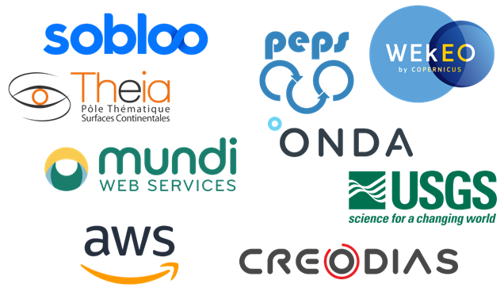
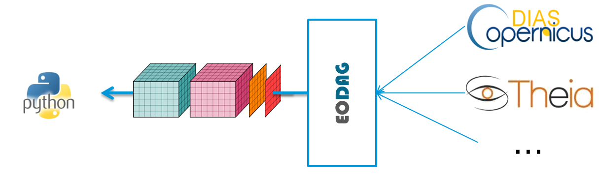
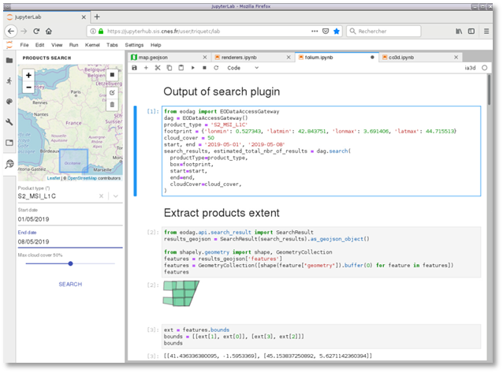
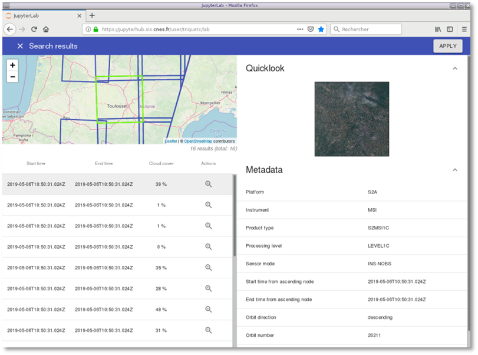
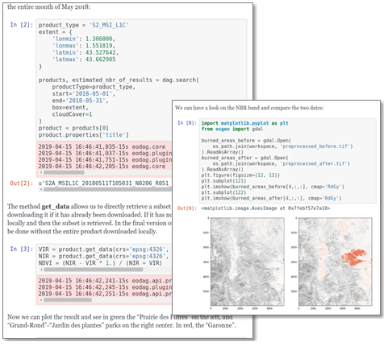
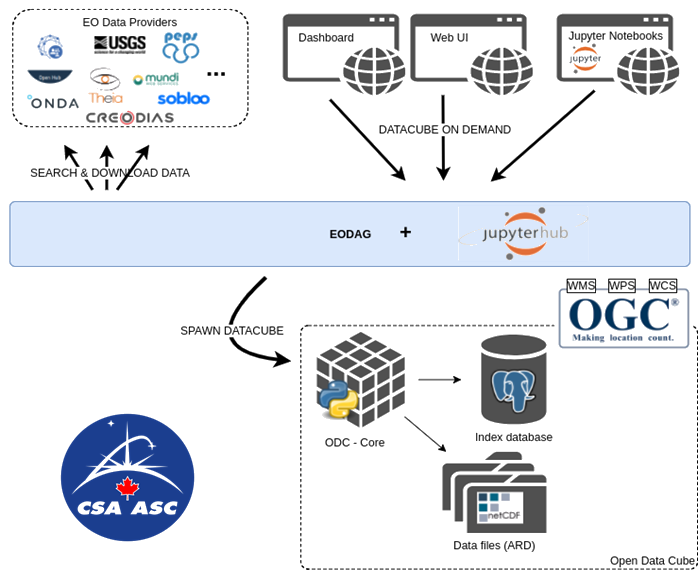

What is {{page.title}}?
----------------------

The increase in the number of publicly available Earth Observation (EO) data is leading to an increase in the number of EO data providers, each potentially having different dataand as many different data access policies:
* Data discovery API : CSW, OpenSearch, custom search, etc.
* Metadata mapping : OpenSearch is a good choice, but every provider as its own metadata grammar
* Product access : object storage S3, file system, FTP, SFTP, etc.
* Product format storage : zipped, unzipped, with added directory levels, etc.
* Authentication mechanisms : OAUTH, JWT, BasicAuth, OIDC, etc.

__{{page.title}} is one library to use them all__: {{page.title}} is a command line tool and a Python SDK for searching, aggregating and downloading remote sensed images while offering a unified API for data access regardless of the data provider.

{{page.title}} (Earth Observation Data Access Gateway) is a command line tool and a plugin-oriented Python framework for searching, aggregating results and downloading remote sensed images while offering a unified API for data access regardless of the data provider. 
The {{page.title}} SDK is structured around five functions:
* List product types: list the supported products types and their description
* Search products: search products according to the search criteria provided
* Store/Load results: (de)serialize the results of a search, allowing the search and download to be unravelled so that they can be used on computing resources.
* Download products : download products in the form they are provided by the providers
* Get product pixels: directly access products’ pixels with band selection, re-projection, cropping, resampling, etc. The data are made available as a labelled multi-dimensional array data structure (more specifically, it is the DataArray structure of the xarray Python module) that can be exported in the NetCDF scientific data format. By now, due to some limitations in providers’ data access policies, {{page.title}} first download the product if necessary before retrieving the pixels. In the future, it will directly stream these pixels from the provider to the user.

	
Features
--------

{{page.title}} is a library for searching, aggregating and downloading remote sensed images while offering a unified API for data access regardless of the data provider.

### {{page.title}} SDK

The {{page.title}} SDK provides the following features:
* List product types: list the supported products types and their description;
* Search products: search products according to the search criteria provided;
* Download products: give an access to the products in a directly usable form (decompression, …);
* Get product pixels: directly access products’ pixels with band selection, re-projection, cropping, resampling, etc. using xarray Python module;
* Store/Load results: (de)serialize the results of a search, allowing the search and download to be executed on distributed computing resources;
* Multi-modal access: CLI, SDK Python, REST Interfaces;
* REST API interroperability: implementing OpenSearch Geo & Time extension;
* Delegation (proxy) to external databases (DIAS, SciHub, Theia, DataLake CNES,...) – no intermediary metadata storage - always up to date;
* Standardization of search semantics: product type, satellite, shooting dates, cloud cover,etc. using OGC OpenSearch for Earth Observation standard for metadata mapping.

### Supported data providers

The following data providers are currently implemented:
* Sobloo - Airbus DIAS
* Creodias - CloudFerro DIAS
* Mundi - Atos DIAS
* Onda - Serco DIAS
* Usgs - U.S geological survey catalog for Landsat products
* AWS - Amazon public bucket for Sentinel 2 products
* Theia - French National Space Agency (CNES) catalog for Sentinel, Pleiades and Landsat products
* Peps - French National Space Agency (CNES) catalog for Copernicus (Sentinel 1, 2, 3) products
* {{page.title}} is easily extensible by configuration or plugin development, __you can add your own !__ or ask us :-)
	
	
### JupyterLab integration

{{page.title}} is integrated in Jupyterlab.
	
It includes the automatic code generation from search results to retrieve products.

	

The the users can preview the search results and their metadata.

	

Architecture
------------

The architecture of {{page.title}} is plugin oriented, with a very simple API, making it easily extensible and able to integrate new data providers.

The plugin system has two levels: the first level provides an abstract interface to {{page.title}} functionalities (called topic plugins). The second level is the implementation of one or more of the first level plugins for a provider.

{{page.title}} exposes its functionalities through a REST API implementing OpenSearch Geo & Time extensions and OGC OpenSearch Extension for Earth Observation standards. Therefore, it can be integrated into different platforms, and used in different programming languages. To validate this API, a JupyterLab extension has successfully made available {{page.title}} search functionality in Jupyter Notebooks.

User benefits
-------------

### Fast

As a result of its architecture, {{page.title}} is almost as fast as its linked providers for search. 

### Large DIAS coverage

{{page.title}} supports all operational DIAS platforms, the Scihub, and many more.

### Easy to learn

{{page.title}} is shipped with 5 fully documented tutorials based on Jupyter Notebooks:
* {{page.title}} basics
* NDVI computation
* Burnt areas mapping with {{page.title}} and gpt (Sentinel-2 data processing)
* Burnt areas mapping with {{page.title}} and snappy (Sentinel-2 data processing)
* Ship detection with {{page.title}} and snap (Sentinel-1 data processing)

### Datacubes on the fly

{{page.title}} is now being integrated with the Opendatacube project, for easily including EO data into a Datacube, or generating datacubes on the fly.

	

What {{site.data.str.pda}} can bring you?
-----------------------------------------

As main {{page.title}} developper, {{site.data.str.pda}} is the ideal partner. We provide you with:
* {{page.title}} specific deployment end to end for your need
* Consulting services around the software:
	* Technical expertise
	* Upstream studies
	* Preliminary analysis
	* Need analysis
	* Functional analysis
	* Prototyping
	* Demonstrators
* Development of new adapter
* New feature development
* Training services:
	* For beginner (1/2 day): todo {{page.title}}
    * For advanced users (1 day): Deploy a optimized multi cloud platform
	