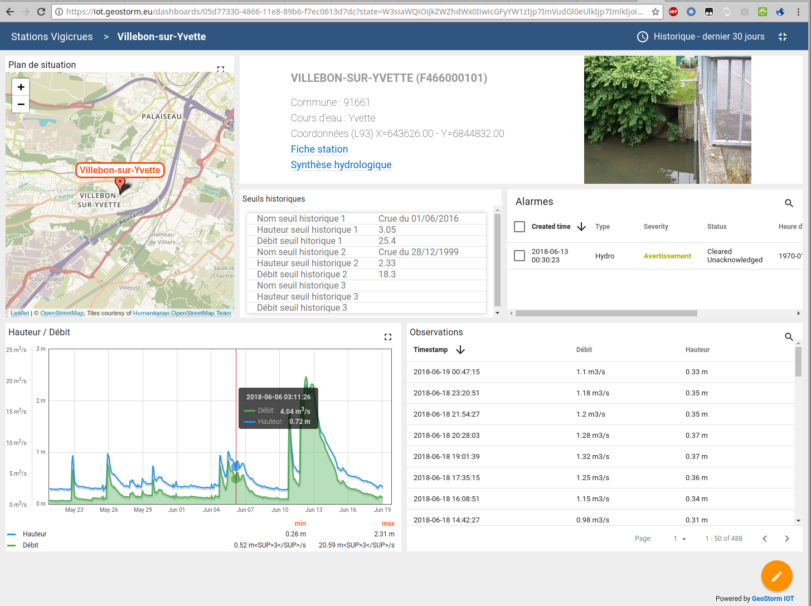

Continuing this work in the field of flood warning systems, CS Group is expanding its field of application and has acquired a new sensor supervision tool to offer a more flexible platform to its customers.
More broadly, supervision is nowadays present in most companies and communities, regardless of their size. It makes it possible to check the state of proper functioning of systems or activities of a computer system.
A major objective of this type of platform, particularly in the field of flood warning, is to be able to warn the personnel in charge of monitoring as quickly as possible so that they can take the necessary actions. 

The IOTSTORM platform is the result of this reflection, and is designed to manage the enormous quantities of data produced by the IIOT (Industrial IOT - Internet of Industrial Objects).
The public IOT standard is now the MQTT, but in the industrial field, each supplier has today its own protocol, even if standardisation is underway. IoTSTORM supports the OPC-UA.

The platform proves to be very efficient for the implementation of real-time infrastructure management systems, allowing a complete follow-up from the supervision of the sensors to the processing of the produced data.

Why choose IotStorm?
--------------------

IotStorm is designed to manage very large volumes of space-time series produced by the IOT:
* Connected sensors
* Environmental data
* GPS positions
* Webcams
	
IoTStorm's HMI is intuitive and can be used by non-computer specialists.

Features	
--------

* Event management: alarms are raised as soon as the telemetry is received when certain criteria are exceeded (thresholds, slope, etc.). 
* Notification: sending alarms (mail, sms, voice) to operators and alerting others in case of no response.
* Configurable dashboards and portal integration
* Ergonomics: the HMI is intuitive and can be used by non-computer specialists.
* API for IOT data ingestion and consultation
