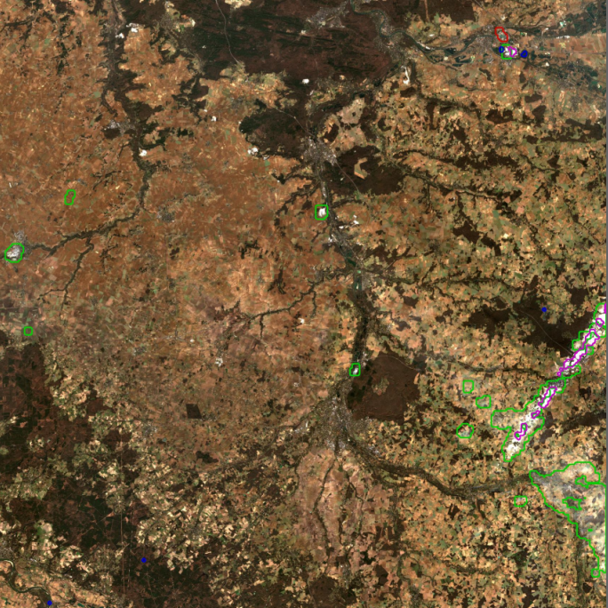

Overview
--------

The {{page.v_lib}} (MACCS ATCOR Joint Algorithm, pronounced "maya") is a cloud detection and atmospheric correction chain based on Orfeo ToolBox (OTB). It is suitable for processing time series of high-resolution images acquired from constant or almost constant angles of view. In particular, it allows the processing of data from LANDSAT and SENTINEL-2.  It is based on the MACCS chain developed by CNES and CESBIO since 2008, and gradually incorporates methods from the DLR ATCOR chain since 2016. It is therefore now the subject of collaboration between CNES, DLR and CESBIO, and receives financial support from ESA. It have been refactored in 2019 to allow dissimination of the scientific algorithms behind as OTB application. More information about MAJA algorithms and performance can be found [here](https://labo.obs-mip.fr/multitemp/category/maja/). 

Features
--------

{{page.v_lib}}'s main features are:
1. Use the multi-temporal information contained in the images to detect clouds and their shadows
2. Estimate the atmospheric content of aerosols and water vapour
3. Correct atmospheric effects (taking into account environmental effects and relief effects

Technical caracteristics
------------------------

Software languages are:
* C++
* Python
* CMake

{{page.v_lib}} is compliant with the following operating systems:
* Linux RedHat 6+ and 7+
* CentOS 6+ and 7+
* Ubuntu 12+


