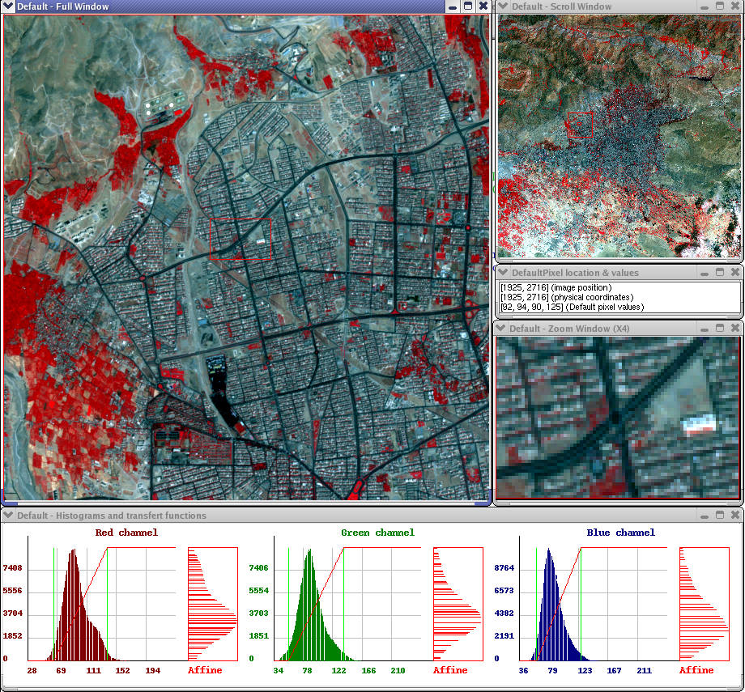

Overview
--------

{{page.v_lib}} (OTB) is an open-source project for state-of-the-art remote sensing, including a fast image viewer, apps callable from Bash, Python or QGIS, and a powerful C++ API.

{{page.v_lib}} is the Earth observation programme, consisting of the dual and bilateral systems (France-Italy) Pleiades (PHR) and Cosmo-Skymed (CSK). The {{page.v_lib}} is part of ORFEO's support program set up to prepare, support and promote the use and exploitation of images from these sensors. The methodological component is based on R&D studies and doctoral and post-doctoral research.
It consists of two parts: the {{page.v_lib}} library of algorithmic bricks and {{page.v_lib}} applications demonstrating the use of the library.

{:.alert .alert-info  }
{{site.data.str.space}} is responsible for the development based on an __eXtreme Programming__ development process. This method, called agile, is a test based method and is clocked by iterative cycles.

Features
--------

Built on the shoulders of the open-source geospatial community, {{page.v_lib}} can process high resolution optical, multispectral and radar images at the terabyte scale. 

A wide variety of applications are available: from ortho-rectification or pansharpening, all the way to classification, SAR processing, and much more.

It is community driven, extensible and heavily documented.

The functionalities of the {{page.v_lib}} library are identified by the following modules:
* Input/Output interface module for reading and writing in common image formats as well as in formats specific to remote sensing,
* Supervised learning and classification module by SVM, SEM, SOM,
* Module for calculating geometric descriptors and extracting information (textures, detection of contours and lines, points of interest, geometric moments, road extraction),
* Image visualization module including advanced features for navigating large images and adjusting color rendering,
* Image mapping module, allowing the estimation of maps of disparities or geometric transformations between pairs of images,
* Radiometric pre-processing module including atmospheric corrections, image calibration and conversion, as well as vegetation index calculations,
* SAR polarimetry module including RAD format reading, polarization synthesis and RADAR polarization architecture, 
* Change detection module with consideration of multi-scale, multi-sensor and 3D aspects,
* Image decomposition and fusion module using multi-resolution techniques,
* Geometric correction module including sensor modeling and major mapping projections.

Most of these features can be applied to large images through a transparent mechanism that reads input data in pieces and manages memory areas. They can also take full advantage of hardware resources with the seamless use of multiple processors.

The {{page.v_lib}} applications are as follows:
* Utilities for generating thumbnails and extracting regions of interest,
* Image viewing application and image metadata display tools,
* Application for automatic orthorectification of images,
* Application of automatic orthofusion of images,
* Supervised classification application,
* Application for detecting changes between images by supervised learning,
* Applications for superimposing images of possibly different modalities,
* Application of image disparity maps calculations (optical and radar),
* Application of geometric transformations of direct and inverse images,
* Application for 3D visualization of stereoscopic data,
* Application of texture calculations,
* Application of land use classification according to the Corin Land Cover convention,
* Object recognition chain.

{{page.v_lib}} also integrates many internal libraries that provide new functionalities. Among them, we can mention: 
* ITK, for algorithmic processing such as filtering, realignment, segmentation,
* FLTK, used for the realization of HMI,
* OSSIM, which provides functionalities related to geometry,
* Dxflib which allows the reading of vector databases in DXF format,
* Boost, which provides representation and algorithmic functionalities for graphs,
* LibSVM, which performs learning and classification by the Vector Machine Media method,
* 6S, which plays a key role in atmospheric correction features,
* Improved OpenJPEG, used for reading/writing JPEG2000 images,
* OpenThread which allows multi-processor management,
* KML for reading in kml data formats.

Technical caracteristics
------------------------

Software languages are:
* C++
* Python
* Java

Dependencies:
* IDL/Envi
* GDAL
* OpenGL
* VTK

{{page.v_lib}} is compliant with the following operating systems:
* Linux
* macOS 
* Windows

All of {{page.v_lib}}’s algorithms are accessible from Monteverdi, QGIS, Python, the command line or C++. Monteverdi is an easy to use visualization tool with an emphasis on hardware accelerated rendering for high resolution imagery (optical and SAR). With it, end-users can visualize huge raw imagery products and access all of the applications in the toolbox. 


