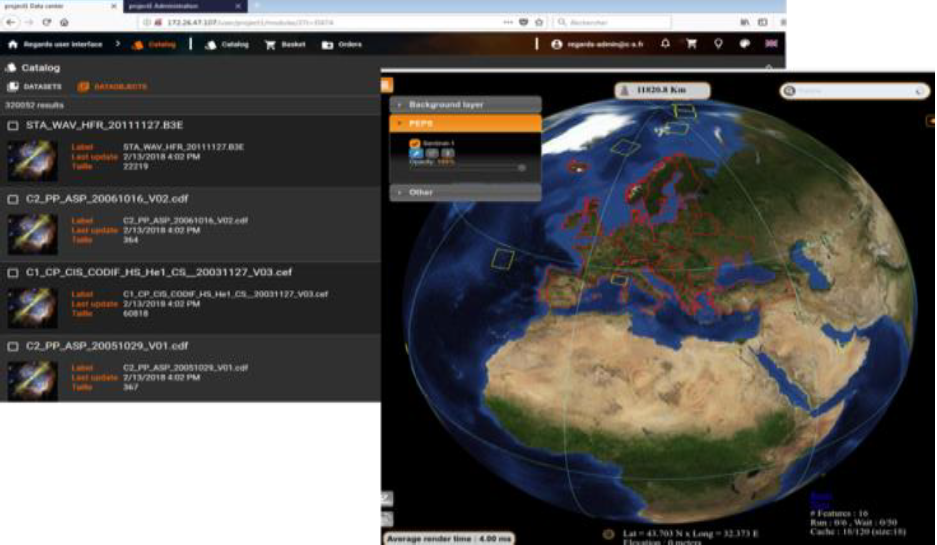

Overview
--------

The REGARDS project (REnouvellement des outils Génériques d’Accès et d’aRchivage pour les Données Spatiales) is at the convergence between two Data Preservation and valorization tools, SIPAD-NG and SITools2. It is a full ground segment product and it can be used by any data center in charge of the implementation of data archiving and/or in charge of a mission or a data center access (research lab or IT services company).

{:.alert .alert-info  }
{{site.data.str.pda}} is responsible for the design, development, integration, maintenance and ppen source promotion.

Features
--------

REGARDS allows:
* To integrate data and metadata supplied by producers in standard or non standard formats with a high degree of efficiency,
* To valorize metadata by enrichment and to make them available to the scientific community via standard interoperability protocols and advanced search interface displays,
* To archive data and metadata in a sustainable way,
* To manage the data from an administrator point of view,
* To allow remote processes via standard protocols (WPS, UWS),
* To be monitored.

Technical caracteristics
------------------------

* Hardware : PC, servers VMWare HP for virtual machines
* OS : Linux Red Hat
* Coding environment : Eclipse JEE, Netbeans, IntelliJ IDEA, Atom
* Coding tools: Apache Maven, Webpack, NPM
* Conf. Management/documentation: Git, Subversion
* Tests : Junit, Selenium (tests IHM), Mockito, TestLink, Spring Test
* Main languages : Java, HTML, CSS, JavaScript, XSD, XML
* DBMS: PostgreSQL, MongoDB, Mysql
* Indexation server : Elasticsearch
* Integration server : Jenkins, Travis CI
* Distributed REST Architecture
* Reactive Web Architecture
* Continuous integration
* modeling tool : Fireworks
* Design modeling : UML-CS / Enterprise Architect
* Open source (Github)
* Formats PAIS, XFDU, FITS
* Protocols WPS, UWS

Services 
--------

Since November 2015, CSSI is responsible for the development of REGARDS. After that, a migration to REGARDS of the projects using SIPAD-NG and SITools2 will be performed. A one year warranty phase and a three years maintenance phase is planned. 
For the moment, the REGARDS project in in its coding/unit tests phase.
