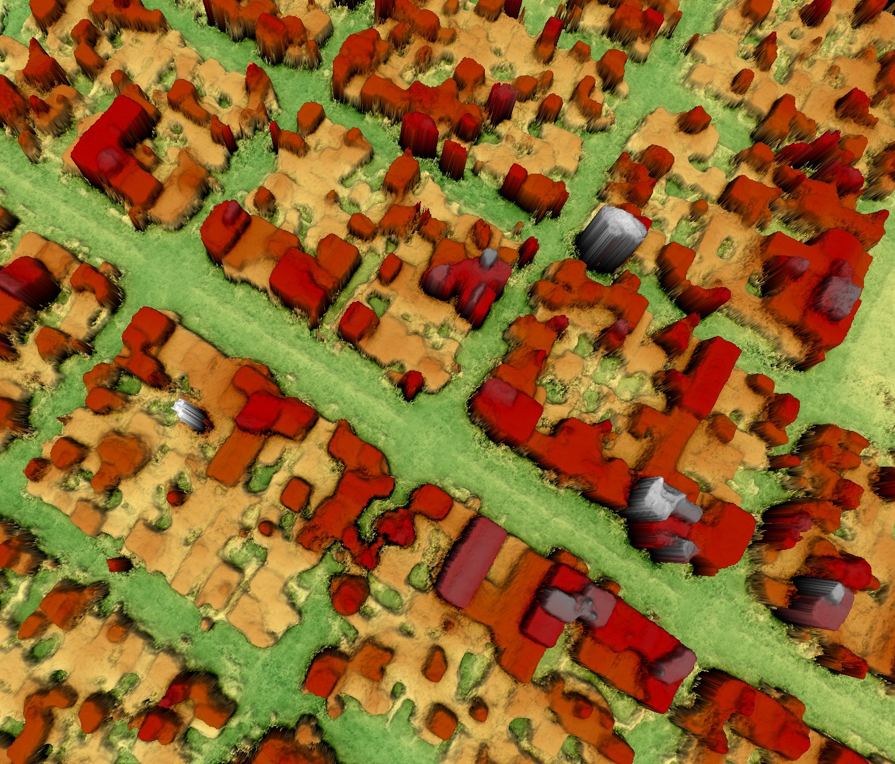

Overview
--------

S2P (Satellite Stereo Pipeline) is a Python library and command line tool that implements a stereo pipeline which produces elevation models from images taken by high resolution optical satellites such as Pléiades, WorldView, QuickBird, Spot or Ikonos. It generates 3D point clouds and digital surface models from stereo pairs (two images) or tri-stereo sets (three images) in a completely automatic fashion.

A wide variety of stereo correlation algorithms are supported, including several flavors of semi-global matching (SGM), TV-L1 optical flow, etc.

S2P was used to win the 2016 IARPA Multi-View Stereo 3D Mapping Challenge.

Features
--------

{{page.v_lib}}'s main features are:
* The pipeline is implemented in the Python package s2p.
* It can produce surface models and 3D point clouds from arbitrarily large regions of interest or from complete images. 
* If needed, it cuts the region of interest in several small tiles and process them in parallel.

Technical caracteristics
------------------------

Software languages are:
* Python
* C

{{page.v_lib}} is compliant with the following operating systems:
* Linux RedHat 6+
* CentOS 6+
* Ubuntu 12+

