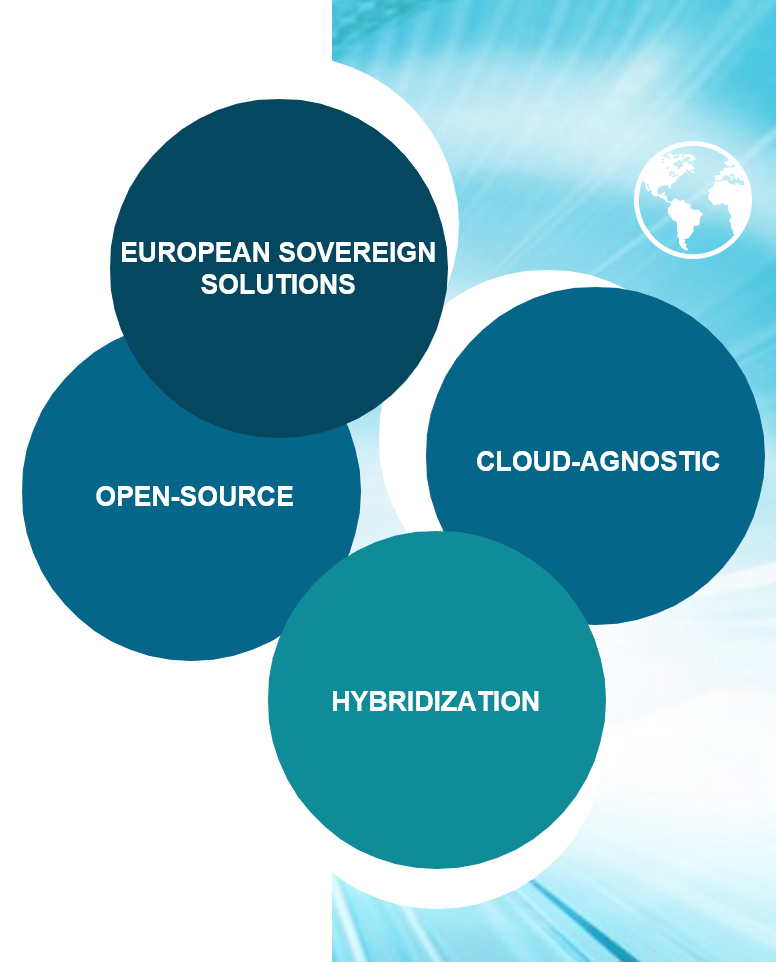
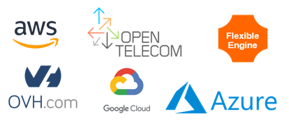
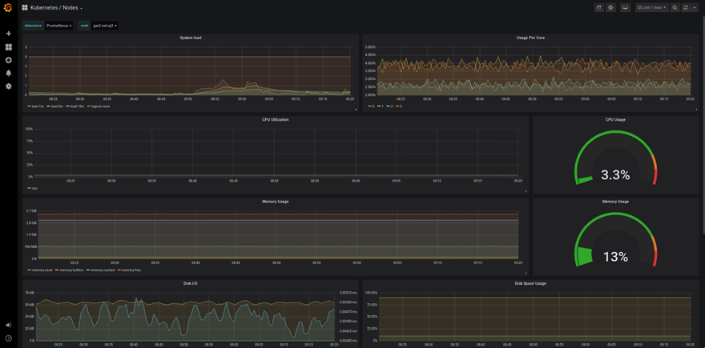

<p class="image-right">	 </p>

<br>

What we believe in...
---------------------

Great things can be done with an appropriate IT environment.

Cloud is one of the key component.

How to improve performance, scalability, & availability while maintaining a high level of security and production & cost controls?

How to define a strategy to easily & securely migrate to the cloud?

How to provide a PaaS provider-agnostic to automatically create and manage ICT & easily deploy secured micro-services?

How to push the automation of infrastructure creation, deployment and maintenance tasks in a DevOps Spirit?

<br>

{:class="lead text-center"}
__To meet such challenges, CS GROUP actively develops {{page.v_safescale}}__

<br>

Whether you simply need to optimize the cost of your infrastructure or get the best performance for your deployments and high-volume data processing, {{page.v_safescale}} is for you!

<br>

What is {{page.v_safescale}}?
----------------------


{{page.v_safescale}} is a multicloud secured management platform that provides a simple and generic way to configure and deploy ad’hoc IT infrastructure regardless of the cloud supplier targeted:
* [Infra](#infra): Cloud agnostic Infrastructure as Code (IaC)
* [Platform](#Platform): Platform as a Service (PaaS)
* [Security](#Security): End-to-end secured solution from host to user access

<p class="image-center">  </p>


​	
Features
--------

### Infra

{{page.v_safescale}} Infra is designed for abstracting cloud services and guaranteeing total independence from cloud services providers (IaaS). 
To overcome their heterogeneities, {{page.v_safescale}} Infra is designed around a unique CLI (command line interface) and an `object storage adapter mechanism

It supports main market infrastructure providers:
* Main European & Non-European cloud providers
* Potentially any Openstack-based cloud providers
* High Performance Computing clusters

__Code your IT once and deploy it anywhere.__


The Infra features are detailed on the [project's page](https://github.com/CS-SI/safescale#safescale-infra).

For example, the following command illustrates how Infra works to create a virtual machine with a single command.

```
>> safescale host create –os "Ubuntu 18.04" --sizing "cpu~=4, ram~=16, cpu-freq>=2" \
--public my-host
```

<p class="image-right">	 </p>

The `object storage adapter mechanism` of Infra supports main market cloud service providers:
* AWS
* Google Cloud Platform
* main European cloud providers offering EO data: OVH, Flexible Engine, Open Telekom Cloud, and CloudFerro.
* all operational DIAS platforms 
* potentially any [Openstack](https://www.openstack.org/)-based cloud providers through generic OpenStack driver. 
* EBRC and Azure drivers are under construction and will be released before the end of the year.

### Platform

{{page.v_safescale}} Platform provides Platform as a Service (PaaS) capabilities:
* Deploy a `standard cluster` with Kubernetes, gateway, integrated monitoring, Helm, Ansible
* Deploy a `specific cluster` with applications that are dedicated to a business line. These clusters can be provided by CS Group on demand.

The Infra features are detailed on the [project's page](https://github.com/CS-SI/safescale#safescale-platform).

For example the following command creates a Kubernetes cluster named k8s-cluster of Normal complexity (3 master nodes).
~~~ bash
>> safescale platform create --flavor K8S --complexity normal k8s-cluster
~~~

<p class="image-center">  </p>


### Security

{{page.v_safescale}} covers several all facets of security:
* On system level, {{page.v_safescale}} proposes [firewalld](https://firewalld.org/) as Firewall, [suricata](https://suricata-ids.org/) as NIDS, [wazuh](https://wazuh.com/) as HIDS
* On service level, {{page.v_safescale}} proposes [Kong Community](https://konghq.com/solutions/kubernetes-ingress/) as API gateway
* On system level, {{page.v_safescale}} proposes [Kong Community](https://konghq.com) as Load Balancer and applicative firewall
* On user level, {{page.v_safescale}} proposes [KeyCloak](https://www.keycloak.org/) for Identity and Access management, social login and identity brokering

The security features are detailed on the [project's page](https://github.com/CS-SI/safescale#safescale-security).

{{page.v_safescale}} is labelled [France Cybersecurity](https://www.francecybersecurity.fr/en/the-label/). This label guarantees users that {{page.v_safescale}} has clear and well-defined functionalities, with a level of quality verified by an independent jury based on existing certifications, an investigation by an independent third party expert and user feedback.
<a class="image-center" href="https://www.francecybersecurity.fr/en/the-label/">  </a>

### Whats new in {{page.v_safescale}}

The latest {{page.v_safescale}} v20.03.0 version released on March 31, 2020 brings you the following new features:
* Added AWS support.
* Added LAN Virtual IP support for OVH provider. 
* Added binaries for macOS 64bits operating system.
* Added binaries for Raspberry Pi 32bits operating system (ARM v5).

[Read more v20.03.0...](https://github.com/CS-SI/SafeScale/releases/tag/v20.03.0) 


User benefits
-------------

### Easy to use

Most operations can be done with a single command with [Infra](#infra) feature. With {{page.v_safescale}} you can create a virtual machine in a few CLI commands and in a few minutes have a thousand of them.
{{page.v_safescale}} greatly reduces learning time and development time. 
You don't have to manage the lower layers, the network part, the square meters, the security, the maintenance and the obsolescence. 

### Open-source

{{page.v_safescale}} is distributed under the {{page.license}} license. 

### Secured

{{page.v_safescale}} provides system firewalls, intrusion detection, web firewall and identity and access management including social login and brokering and monitoring security dashboards

What {{site.data.str.pda}} can bring you?
-----------------------------------------

As main {{page.v_safescale}} developper, {{site.data.str.pda}} is the ideal partner. We provide you with:
* {{page.v_safescale}} specific deployment end to end for your need
* Consulting services around the software:
	* Technical expertise
	* Upstream studies
	* Preliminary analysis
	* Need analysis
	* Functional analysis
	* Prototyping
	* Demonstrators
* Development of new object storage adapter
* New feature development
* Training services:
	* For beginner (1/2 day): Deploy a virtual computer with {{page.v_safescale}}
    * For advanced users (1 day): Deploy a optimized multi cloud platform


Contact: [contact@safescale.eu](mailto:contact@safescale.eu)


{::comment}Abbreviations{:/comment}

*[CLI]: Command Line Interface
*[IaC]: Infrastructure as Code
*[PaaS]: Platform as a Service
*[VM]: Virtual Machine
*[OS]: Operating System
*[IAM]: Identity and Access Management
*[SIEM]: Security Information and Event Management
*[SSO]: Single Sign On
*[IDS]: intrusion detection
*[IPS]: intrusion prevention
*[NSM]: network security monitoring
*[DRMAA]: Distributed Resource Management Application API is a high-level Open Grid Forum API specification for the submission and control of jobs to a Distributed Resource Management (DRM) system, such as a Cluster or Grid computing infrastructure.
