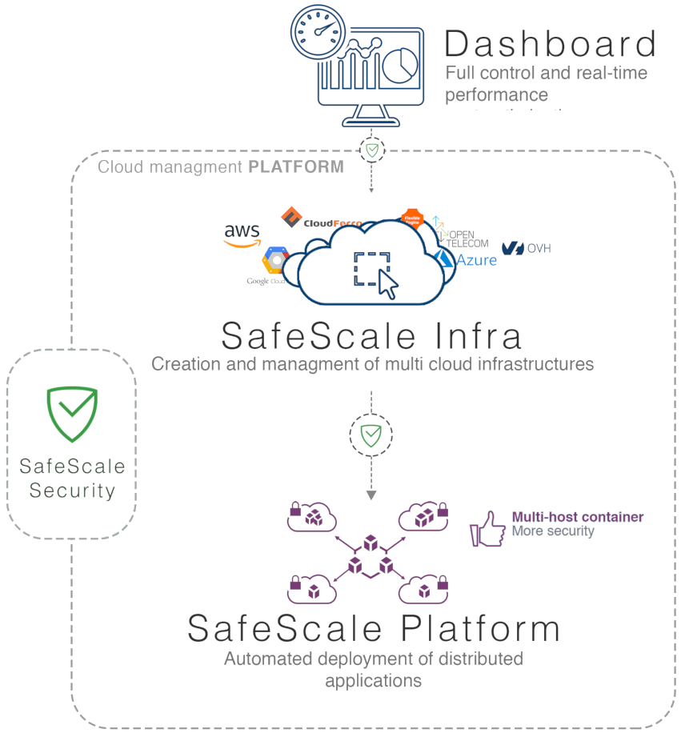
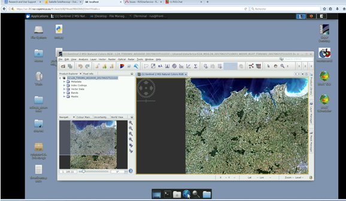
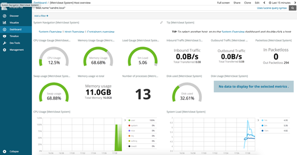
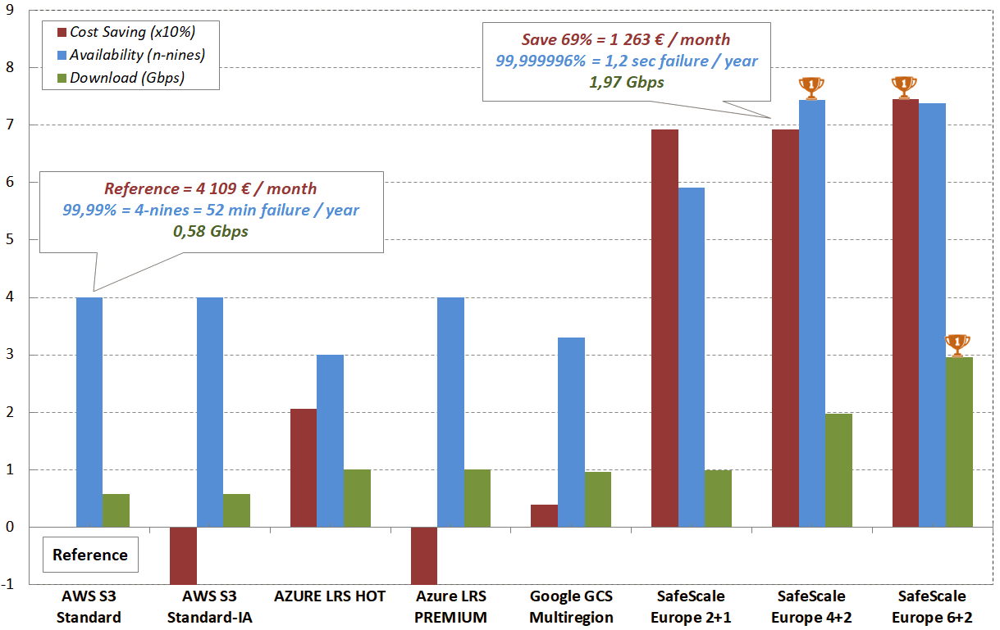

What is {{page.v_safescale}}?
----------------------


<p class="image-right">	 </p>

{{page.v_safescale}} is a multicloud secured management platform that provides a simple and generic way to configure and deploy ad’hoc IT infrastructure regardless of the cloud supplier targeted and their inherent heterogeneities:
* [Infra](#infra): Cloud agnostic IaC (Infrastructure as Code)
* [Perform](#perform): PaaS (Platform as a Service)
* [Remote Desktop](#remote-desktop): Full control of any allocated resources
* [Dashboard](#dashboard): Full reporting of any allocated resources
* [{{page.v_erasure_coding}}](#{{page.v_erasure_coding_id}}): combines the power of several cloud services providers to increase transfer speed and reliability.
* [Hybrid encryption](#hybrid-encryption): combines symmetric and asymmetric ciphering algorithms to increase data access security.

Whether you simply need to optimize the cost of your infrastructure or get the best performance for your deployments and high-volume data processing, {{page.v_safescale}} is for you!


	
Features
--------

### Infra


{{page.v_safescale}} Infra is designed for abstracting cloud services and guaranteeing total independence from cloud services providers. 
To overcome their heterogeneities, Infra is designed around a unique CLI (command line interface) and an `object storage adapter mechanism`.

The CLI provides IaC. It provides sevral commands to:
* List the available VM templates 
* List the available OS images
* Create or destroy of a network
* Create or destroy of a VM
* Create or destroy of a Block Storage
* Assign/unassigned an public IP to a virtual machine
* Create or destroy of clusters
* Resize both calculation node and block storage
* Generic image naming by using an image name solver (use Jaro-Winkler algorithm to identify the most accurate name)

For example, the following command illustrates how Infra works to create a virtual machine with a single command.

```
>> safescale network create --cidr 192.168.2.0/24 \
   --gwname cluster-front \
   –os "Ubuntu 16.04" \
   --cpu 8 --ram 30 \
   cluster-net
```


<p class="image-right">	 </p>
The `object storage adapter mechanism` of Infra supports main market cloud service providers:
* main European cloud providers offering EO data: OVH, Flexible Engine, Open Telekom Cloud, and CloudFerro.
* all operational DIAS platforms 
* potentially any [Openstack](https://www.openstack.org/)-based cloud providers through generic OpenStack driver. 
* Google Cloud Platform
* AWS, ERBC and Azure drivers are under construction and will be released before the end of the year.


It allows to develop once and deploy wherever.  


### Perform

{{page.v_safescale}} Perform provides PaaS (Platform as a Service) capabilities:
* Deploy a `standard cluster`
* Deploy a `specific cluster`
Deployement commands are executed in parallel to improve the speed. 

Perform can deploy a `standard cluster` with minimal features:
* Cluster management features: Swarm, Kubernetes, DCos, BOH
* The gateway, including:
	* The reverse proxy with only SSH and HTTPS access
	* The load balancer over the clusters
* The [remote desktop](#remote-desktop)

For example the following command creates a Kubernetes cluster named k8s-cluster of Normal complexity (3 master nodes).
~~~ bash
>> safescale cluster create --flavor K8S --complexity normal k8s-cluster
~~~

Additional features can be installed too:
* IAM feature based on KeyCloak  
* [SIEM feature](#focus-on-security)  

Perform can deploy a `specific cluster` with applications that are dedicated to a business line. Three infrastructure templates are available:
* Big Data with Spark + Hadoop + Ignite
* IA with TensorFlow + Ignite
* HPC with OHPC + DRMAA + MPI

### Remote Desktop



VM created with {{page.v_safescale}} are accessible using ‘safecale ssh’ tool or a full web remote desktop build on Apache Guacamole.

The remote desktop provides a full control of any allocated resources.

* Full HTML5 web desktop 
* Works even if you have poor connection to the cloud.
* Resizable and multilingual
* Simple file transfers through drag and drop.
* Virtual keyboard and mouse for touch devices.


### Dashboard



To offer a global infrastructure monitoring solution {{page.v_safescale}} Infra relies on Elastic Stack open source solution. The operating principle of the monitoring system is simple. On all VMs created by {{page.v_safescale}} Infra, the Elastic Metric Beat probe is installed. The latter transmits to ElasticSearch the CPU, memory, the file system, the disk IO, and the network IO usage statistics, as well as top-like statistics for every process running on your systems. 

The Kibana dashboard creation system is used to create ergonomic dashboards: 
* Real-time cost measurement and cost optimization actions, based on alarms
* Monitoring with Elastic Metric Beat probes
    * CPU
    * memory
    * file system
    * disk IO
    * network IO
    * ergonomic dashboards
    * Dashboard

### {{page.v_erasure_coding}}

Erasure coding of data is all about making data highly available. In simple terms it breaks data into a configurable number of parts and distributes those parts across a set of different storage systems. This feature combines the power of several cloud services providers to increase transfer speed and reliability.

It splits the data to be stored in blocks, creates a parity block using 2 or more data blocks using Reed-Solomon code, encrypts each block and distributes them over several object storage buckets on different clouds. Several configuration are possible.

For example with 4 storage and 2 parities, called 4+2:
* Data are distributes over 4 storages. 2 other storages are use for redundant data.
* Every 4 data blocks, two redondant blocks are calculated (parity) and stored. This makes it possible to deal with one or two failures without interrupting data access. This improves the availability rate.
* 4 blocks can be read at the same time. This improves the reading speed to four times the speed of the slowest data center.
* 4 blocks can be written at the same time. This improves the writing speed to four times the speed of the slowest data center. 


### Hybrid encryption

To encrypt blocks, {{page.v_safescale}} uses hybrid encryption. It combines the convenience of an asymmetric-key cryptosystem with the efficiency of a symmetric-key cryptosystem. Symmetric encryption is used to encrypt data efficiently; asymmetric encryption is used to encrypt symmetric keys. The encrypted symmetric key and the footprint of the block are added to the header of each blocks.


Focus on security
-----------------

{{page.v_safescale}} covers several facets of security:
* Security of services: {{page.v_safescale}} provides a gateway system that offers encryption and identity management including access encryption, Web Firewall, IAM, SSO, Identity brokering.
* Data security: {{page.v_safescale}} is able to distribute data on different clouds with an hybrid encryption. It combines the convenience of an asymmetric-key cryptosystem with the efficiency of a symmetric-key cryptosystem. 
* SIEM as a Service: intrusion detection (IDS), intrusion prevention (IPS), network security monitoring (NSM) with {{site.data.str.cs}} [Prelude&#153;](https://www.prelude-siem.com/) or [Suricata](https://suricata-ids.org/features/all-features/) open-source software.


User benefits
-------------

### Easy to use

Most operations can be done with a single command with [Infra](#infra) feature. With {{page.v_safescale}} you can create a virtual machine in a few CLI commands and in a few minutes have a thousand of them.
{{page.v_safescale}} greatly reduces learning time and development time. 
You don't have to manage the lower layers, the network part, the square meters, the security, the maintenance and the obsolescence. 


### Reduce your hosting costs

Data preservation is based on the powerful [Erasing Coding of Data](#{{page.v_erasure_coding_id}}) feature and cloud agnostic CLI. You can structure your data distribution over several providers. 

Then you can easily migrate your data without service interruption. As your data are spread, encoded and connected over different cloud locations depending on your needs and priorities, each data fragment can easily switch from one cloud provider to another at a lower cost. You become independant of their price and their terms of use.


### Increase the performances *and* reduce the price!

The powerful [Erasing Coding of Data](#{{page.v_erasure_coding_id}}) feature can improve the performance and reduce the price at the same time! 

For example 4+2 configuration with optimized european providers (50% of storage is used for replication) reduces the price and increases the reliablity up to 99,9999963% ("seven nines"). Where AWS S3 has 52 minutes of failure per year, SafeScale 4+2 has 1.2 second.

<p></p>

_This comparison assumes a storage of 50 GB with file bigger than 1 MB; writing 50 GB per month; reading 5 GB per month. 4+2 and 6+2 configurations distribute data in 2 data-centers per provider hosted by respectively 3 and 4 providers. The probability of a second failure for the same provider is the probability of the first failure x10. Providers have been selected in Europe for this study: OVH réplica x3, Aruba Cloud 50000, Exoscale and Scaleway. The duration of the contracts is at least 6 months. Out transfers are mainly to Europe. Price and performance information was collected on July 9, 2019 on the Internet._

### High level of security

SafeScale protects you infrastructure from:
* Network or storage failure with [Erasing Coding of Data](#{{page.v_erasure_coding_id}}) feature
* Access by an unauthorized person with [security](#focus-on-security) features

### Open-source

{{page.v_safescale}} is distributed under the {{page.license}} license. 


What {{site.data.str.pda}} can bring you?
-----------------------------------------

As main {{page.v_safescale}} developper, {{site.data.str.pda}} is the ideal partner. We provide you with:
* {{page.v_safescale}} specific deployment end to end for your need
* Consulting services around the software:
	* Technical expertise
	* Upstream studies
	* Preliminary analysis
	* Need analysis
	* Functional analysis
	* Prototyping
	* Demonstrators
* Development of new object storage adapter
* New feature development
* Training services:
	* For beginner (1/2 day): Deploy a virtual computer with {{page.v_safescale}}
    * For advanced users (1 day): Deploy a optimized multi cloud platform


Contact: [contact@safescale.eu](mailto:contact@safescale.eu)


{::comment}Abbreviations{:/comment}

*[CLI]: Command Line Interface
*[IaC]: Infrastructure as Code
*[PaaS]: Platform as a Service
*[VM]: Virtual Machine
*[OS]: Operating System
*[IAM]: Identity and Access Management
*[SIEM]: Security Information and Event Management
*[SSO]: Single Sign On
*[IDS]: intrusion detection
*[IPS]: intrusion prevention
*[NSM]: network security monitoring
*[DRMAA]: Distributed Resource Management Application API is a high-level Open Grid Forum API specification for the submission and control of jobs to a Distributed Resource Management (DRM) system, such as a Cluster or Grid computing infrastructure.
*[hybrid encryption]: Symmetric encryption is used to encrypt data efficiently; asymmetric encryption is used to encrypt symmetric keys.