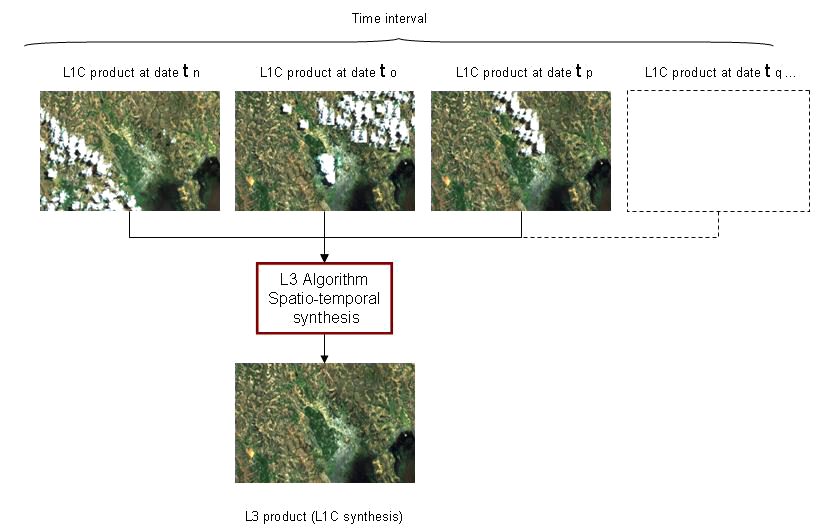
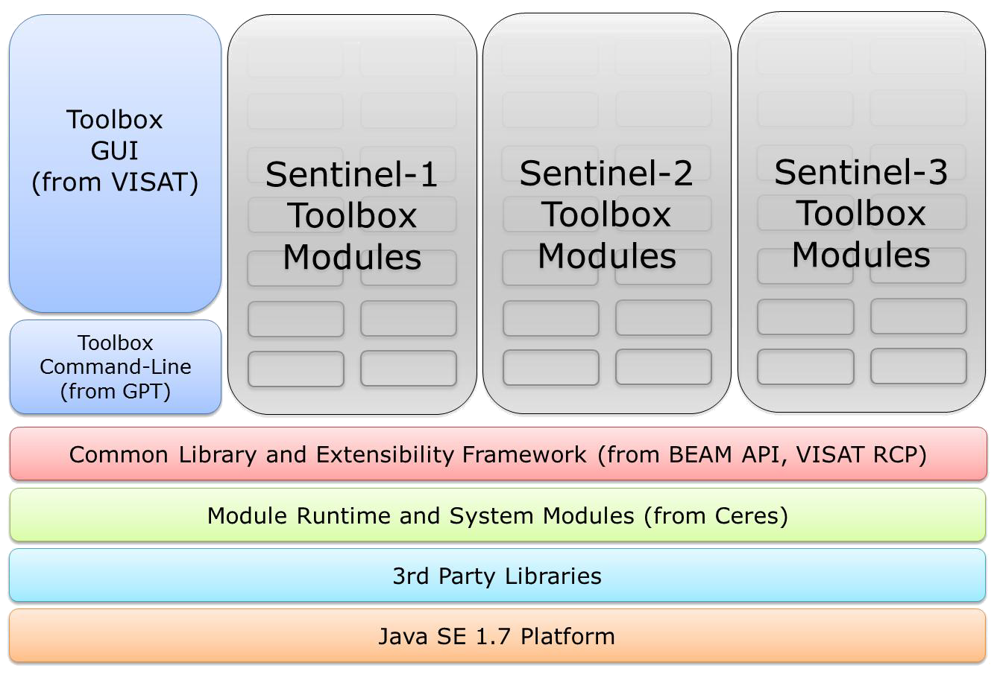

Overview
--------

Sentinel-2 is a polar orbiting satellite constellation of two (initially A and B units) carrying each one an optical imaging sensor called MSI (Multi-Spectral Instrument). The Sentinel-2 Toolbox development is monitored by the Sentinel Toolbox Developer Forum (STDF) in strong relationship between the ESA Technical Officers of each Sentinel-1, 2 & 3 Toolbox and the consortia in charge of each toolbox development led respectively by Array, Canada, {{site.data.str.cs}}, France and Brockmann Consult, Germany. The three Toolboxes are largely leveraging on BEAM & NEST heritage, improving them with a common core and three specific add-ons, one for each Sentinel missions.

Example of use: the Level-3 Processor enabling to remove clouds from L1C or L2A products time series.

The Sentinel-2 Toolbox ({{page.v_lib}}) consists of a rich set of visualisation, analysis and processing tools for the exploitation of MSI data from the upcoming Sentinel-2 mission.
{{site.data.str.pda}} develops new features for this open-source project.

{:.alert .alert-info  }
{{site.data.str.pda}}, as consortium leader, manages the project at managerial and technical level and coordinates the activities of its partners. {{site.data.str.pda}} also provides its image and OTB expertise and participates in developments.

Features
--------

### Objective

The objective of this project is to develop an open-source, flexible and re-usable scientific multi-mission Toolbox based on an extension of BEAM, facilitating the handling, post-processing and scientific analysis of the data products from the Multi-Spectral Instrument (MSI) of the Sentinel-2 mission. The S-2 Toolbox will in particular:
* integrate several scientific processor and firstly the Level-2A processor (Sen2Cor) and a L3 processor,
* interface with third party software like Orfeo Toolbox,
* Interface with other languages (C/C++, Python)
* offer scripting facilities
* support a large set of multi-spectral imaging sensors. 

### API Wrapper 

The current API is in Java and there is a need for other language support as well:
* Use the Toolbox from Python and C Programs: allows Python and C programmers to use BEAM functions in their own Python or C/C++ programs.
* Extend the Toolbox using Python or C: allows invocation of user-provided functions or operators.
* Extend the Toolbox using Orfeo Toolbox: One possible application of being able to write extensions with C/C++ is to be able to call OTB image processing filters and classifiers inside a BEAM GPF operator.

### Sen2Cor integration

The Sentinel-2 Toolbox will not only enable to visualize and propose classical filtering, classification and statistics tools but will also integrate the Sen2Cor processor in order to enable the L2A product generation from L1C.

Technical caracteristics
------------------------

### Sentinel-2 Toolbox Architecture

All toolboxes are composed of a number of dedicated modules (in gray in the figure below) as well as modules that are shared and can be exchanged between the toolboxes. The figure shows the common user interfaces for all three toolboxes, namely the adaptable and extendible GUI (from VISAT heritage) and a single command-line interface for all tools (from BEAM GPT heritage). In order to support this idea, the STDF plays a central role in this project for the evolution of the common software basis.

Software languages are:
* C/C++ 

Related libaries:
* OTB

{{page.v_lib}} is compliant with the following operating systems:
* Linux RedHat 6+
* CentOS 6+
* Ubuntu 12+

