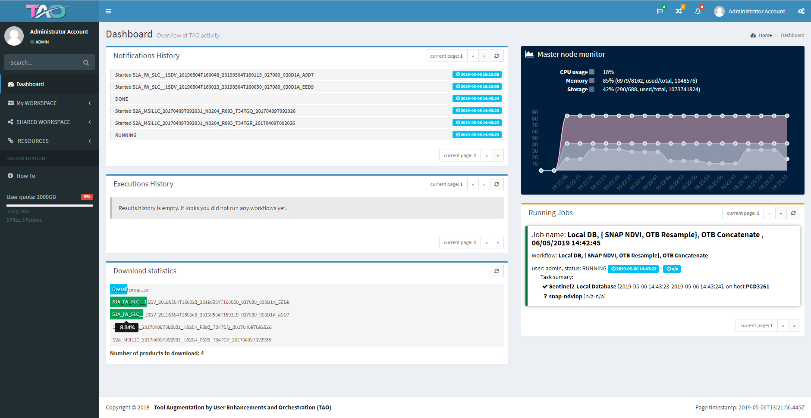

Overview
--------

{{page.v_lib}} (stands for Tool Augmentation by user enhancements and Orchestration) is a lightweight, generic
integration and distributed orchestration framework. It allows to integrate commonly used toolboxes (such
as, but not limited to, SNAP, Orfeo Toolbox, GDAL, PolSARPro, etc.). This framework allows for
processing composition and distribution in such a way that end users could define by themselves
processing workflows and easily integrate additional processing modules (by processing module it is
understood either a standalone executable or a script).

In terms of use, the {{page.v_lib}} provides a mean for orchestration of heterogeneous processing
components and libraries in order to process scientific data. This is achieved in following steps:
* Preparation of resources (including processing components) and data input
* Definition of a workflow as a processing chain
* Execution of workflows
* Retrieval / visualization of the results.

To have a simple view of the {{page.v_lib}}, the platform model is split among four main macro-components.
Such a macro-component is a logical collection of components with related functions. It has no direct
relationship to the software implementation.

Features
--------

The key features of the TAO framework consist in:
* Visual integration of EO processing toolboxes (the user can perform such an integration by him-/her-self, without programming knowledge)
* A pre-defined set of Docker containers for Orfeo Toolbox, SNAP, GDAL and Python 2.7 
* Visual definition of processing workflows by simple dragand-drop operations and easy parametrization of the workflow elements
* Integration of user-defined algorithms, written in Python, in the processing workflows

* Visual definition of execution topologies (collection of machines onto which components are executed)
* Orchestrated execution of workflows, employing different DRMAA-compliant Cluster Resource Manager software, such as Torque or SLURM 
* Self-contained containerized execution of components on remote nodes so that they do not interfere with other components
* Basic visual monitoring of executions and topology nodes resources

Technical caracteristics
------------------------

Software languages are:
* Java
* Python
* HTML

