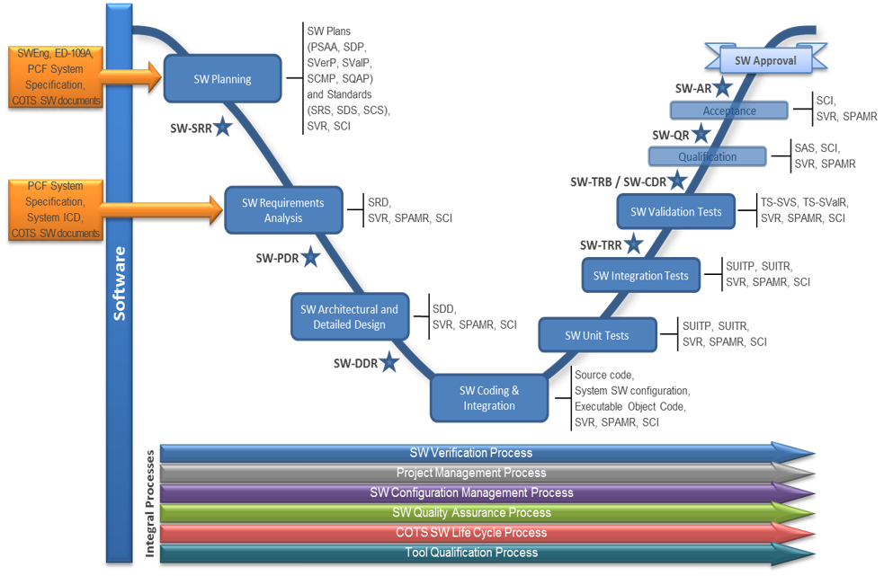

> __Customer__\: Airbus Defence & Space (ADS FOR ESA)

> __Programme__\: EGNOS

> __Supply Chain__\: ADS FOR ESA >  CS Group SPACE

# Context

**Technical challenges:**
* Team members from different CS business units since PCF concerns different expertise areas:
* orbitography
* space mechanics
* real-time critical systems
* navigation
	**Compliance with ECSS-Q-ST-40C, ECSS-Q-ST-30-02C, ECSS-Q-HB-80-03A standards on Safety with main methods faced:**
* Functional Hazard Assessment (FHA)
* Preliminary System Safety Assessment (PSSA)
* System Safety Assessment (SSA)
* Fault Tree Analysis (FTA)
* Failure Mode and Effects Analysis (FMEA)
* Hardware/Software Interaction Analysis (HSIA)
* Failure Detection, Isolation and Recovery Analysis (FDIR)
* Maintainability Analysis
* Common Mode and Common Cause Analysis (CMA, CCA)
	**Compliance with ECSS-E-ST-10C "System engineering general requirements“ for Requirements specification :**
* The Reqtify tool supports the generation of traceability matrices of requirements and tests between
* different documents. The verification of these matrices, through the check of the Reqtify tool outputs,
* is part of the verification that top-down requirement allocations and bottom-up requirement verification
* are correct, complete and consistent.
* The following traceability analyses are conducted:
* Coverage analysis of the requirements baseline and software development outputs (technical
* specification, design, source code) between them, and production of associated bidirectional
* traceability matrices,
* Coverage analysis of the requirements baseline and the software development outputs (technical
* specification, design, source code) by tests, and production of associated bidirectional traceability
* matrices. The results (i.e. bidirectional traceability matrices, as well as any needed justification for instance with
* respect to derived requirements) are documented within the Verification Control Document (VCD) and
* the Software Traceability File (STF).

CS Group responsabilities for Prediction Chain Facility (PCF) are as follows:
* Development, Integration, Qualification and Support for the SoL approval of the PCF

The features are as follows:
* Check and pre-process the RIMS observables received for the Prediction chain
* Determine the ionosphere corrections and error bounding parameters and ionosphere corrections 
* Schedule the appropriate SBAS message taking using the bandwidth, TTA, Integrity constraints
* Format the EGNOS messages with the applicable standards, using correction parameters computed above
* Compute the Quality of Service (QoS) indicator based on the corresponding PCF/ICF computations for the virtual GEO lane
* Send the SBAS messages to ICF for verification before provision to NLES

# Project implementation

The project objectives are as follows:
* PCF is in charge of the computation of the satellite and ionosphere corrections and error bounding prediction parameters, formatting and scheduling of the EGNOS messages and generation of Quality of Service (QoS) parameter.

The processes for carrying out the project are:
* V cycle

# Technical characteristics

The solution key points are as follows:
* Compliance with ECSS-Q-ST-40C, ECSS-Q-ST-30-02C, ECSS-Q-HB-80-03A standards on Safety with main methods faced
* Compliance with ECSS-E-ST-10C "System engineering general requirements“ for Requirements specification 
* Writing of all the Safety and Dependability activities in the Software RAMS Plan

The main technologies used in this project are:

{:class="table table-bordered table-dark"}
| Domain | Technology(ies) |
|--------|----------------|
|Operating System(s)|Linux|
|Programming language(s)|C|
|Production software (IDE, DEVOPS etc.)|Enterprise Architect, Eclipse IDE, Klocwork, RTRT, Jenkins and Mantis|

{::comment}Abbreviations{:/comment}

*[CLI]: Command Line Interface
*[IaC]: Infrastructure as Code
*[PaaS]: Platform as a Service
*[VM]: Virtual Machine
*[OS]: Operating System
*[IAM]: Identity and Access Management
*[SIEM]: Security Information and Event Management
*[SSO]: Single Sign On
*[IDS]: intrusion detection
*[IPS]: intrusion prevention
*[NSM]: network security monitoring
*[DRMAA]: Distributed Resource Management Application API is a high-level Open Grid Forum API specification for the submission and control of jobs to a Distributed Resource Management (DRM) system, such as a Cluster or Grid computing infrastructure.
