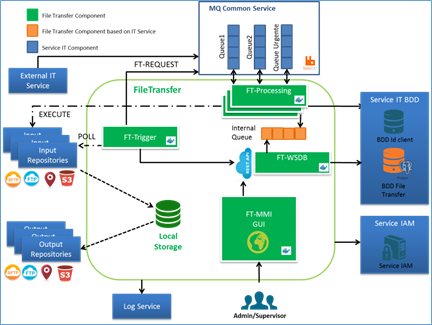
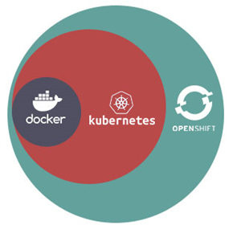

> __Customer__\: Airbus Defense and Space Geo (ADS-GEO)

> __Programme__\: Geo Digital System

> __Supply Chain__\: ADS-GEO >  CS Group PDA

# Context

CS Group responsabilities are as follows:
* Maintenance, Reversibility

The features are as follows:
* Generate the Docker image of broker Rabbit MQ
* Generate security certificats for Rabbit MQ
* Install Tiller tool (Helm server part)
* Update Rabbit MQ already deployed, uninstall
* Configuration for the deployment Rabbit MQ from configuration files
* Display actions and errors provided by the tool

# Project implementation

The project objectives are as follows:
* This tool allows to deploy the Rabbit MQ broker in different Kubernetes environments (native Google K8S, Openshift, Google Kubernetes Engine) 
* The deployment is operated using the Docker image of the broker Rabbit MQ.

The processes for carrying out the project are:
* Continuous integration

# Technical characteristics

The solution key points are as follows:
* Detailled configuration
* Installation in Google K8S Openshift, Google Cloud

The main technologies used in this project are:

{:class="table table-bordered table-dark"}
| Domain | Technology(ies) |
|--------|----------------|
|Operating System(s)|Linux|
|Programming language(s)|Bash, Helm Chart (Yaml)|
|Production software (IDE, DEVOPS etc.)|Eclipse, Visual Studio Code, TestLink|
|Main COTS library(ies)|RabbitMQ, CURL, Helm/Tiller, Kubectl, oc|

{::comment}Abbreviations{:/comment}

*[CLI]: Command Line Interface
*[IaC]: Infrastructure as Code
*[PaaS]: Platform as a Service
*[VM]: Virtual Machine
*[OS]: Operating System
*[IAM]: Identity and Access Management
*[SIEM]: Security Information and Event Management
*[SSO]: Single Sign On
*[IDS]: intrusion detection
*[IPS]: intrusion prevention
*[NSM]: network security monitoring
*[DRMAA]: Distributed Resource Management Application API is a high-level Open Grid Forum API specification for the submission and control of jobs to a Distributed Resource Management (DRM) system, such as a Cluster or Grid computing infrastructure.
