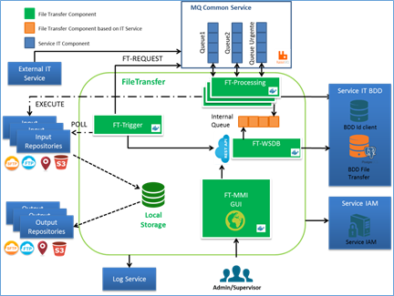

> __Customer__\: Airbus Defense and Space Geo (ADS-GEO)

> __Programme__\: Geo Digital System

> __Supply Chain__\: ADS-GEO >  CS Group PDA

# Context

Notification Service processes and delivers in different media all notification requests of  GDS sub-systems and others services of system for external or internal users
* Receives notifications thru Message Queuing Common service,
* Processes and if necessary formats the notification requests from patterns (instantiation of message model, elements  by using key/value and names of recipients)
* Transfers the processed and instantiated notification requests to corresponding GDS technical services to deliver the notifications.

CS Group responsabilities are as follows:
* Design, Development, Support service for deployment and use

The features are as follows:
* Manages media for delivery notifications: Mail, SMS, WebHook,
* Offers multiple entry points: Message Queuing service,  API Rest (external service), Mailbox service (legacy mails), MMI (admin/supervisor accounts).
* Monitors notification requests (error handling, notifications status management, logs management),
* Check authentication of users from service IAM and LDAP
* Proposes MMI to: 
	* monitor system and notification requests,
	* create templates and notification definitions,
	* send new notification requests.

# Project implementation

The project objectives are as follows:
* Notification Service processes and delivers in different media all notification requests of  GDS sub-systems and others services of system for external or internal users

The processes for carrying out the project are:
* Continuous integration

# Technical characteristics

The solution key points are as follows:
* RESTfull web services architecture (BackEnd) 
* Independent software components provide great modularity
* Load-balancing mechanism
* Redundancy system
* Structure based on container platforms (docker)

The main technologies used in this project are:

{:class="table table-bordered table-dark"}
| Domain | Technology(ies) |
|--------|----------------|
|Operating System(s)|Linux|
|Programming language(s)|Java, Python, Bash, HTML, XSL, CURL|
|Interoperability (protocols, format, APIs)|JSON, XML, LDAP, FTP, FTPS, SFTP, GRIDFTP, FXP, CLOUD S3, RESTful API, AMQP, TLS v1.2|
|Production software (IDE, DEVOPS etc.)|Eclipse, Testlink|
|Main COTS library(ies)|Angular 2, Spring, Docker, PostgreSQL, RabbitMQ, Maven, Hibernate, Apache Commons|

{::comment}Abbreviations{:/comment}

*[CLI]: Command Line Interface
*[IaC]: Infrastructure as Code
*[PaaS]: Platform as a Service
*[VM]: Virtual Machine
*[OS]: Operating System
*[IAM]: Identity and Access Management
*[SIEM]: Security Information and Event Management
*[SSO]: Single Sign On
*[IDS]: intrusion detection
*[IPS]: intrusion prevention
*[NSM]: network security monitoring
*[DRMAA]: Distributed Resource Management Application API is a high-level Open Grid Forum API specification for the submission and control of jobs to a Distributed Resource Management (DRM) system, such as a Cluster or Grid computing infrastructure.
