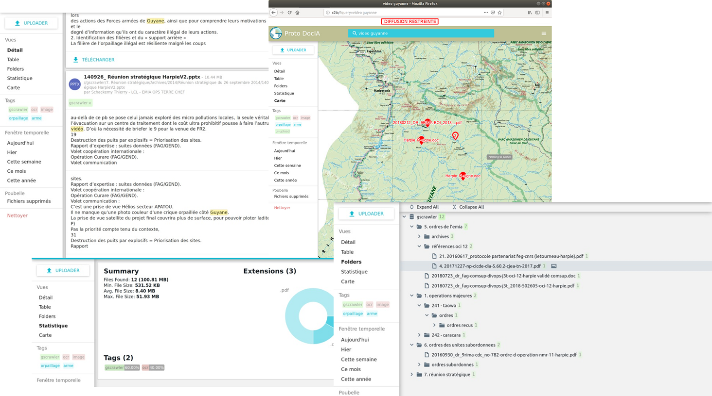
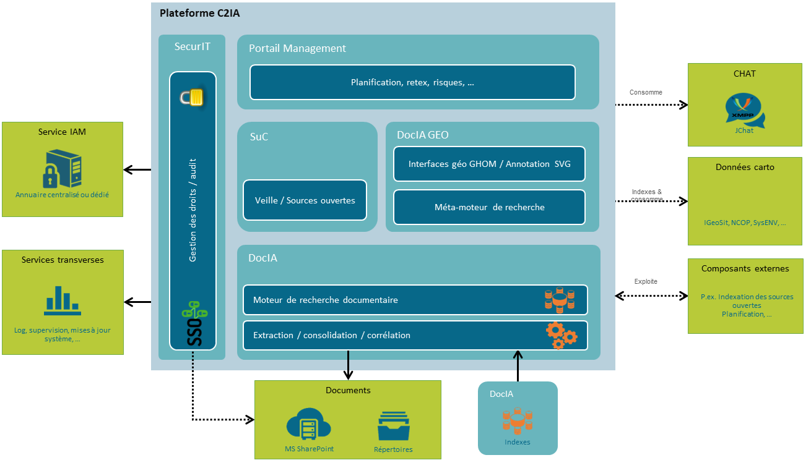

> __Customer__\: Agence de l’innovation de défense (AID)

> __Programme__\: C2IA

> __Supply Chain__\: AID >  CS Group PDA

# Context

DOCIA: Operational tool for information processing and retrieval. The idea is not to change the way in which data is archived, but to rely effectively on the organizational and technical means deployed or in the process of being deployed.

CS Group responsabilities for Prototype of a platform for document retrieval and advanced indexing are as follows:
* Need analysis
* Design & development

The features are as follows:
* Full text, metadata and temporal search with highlights
* 5 views:
	* _Details_ is text blocks corresponding to the search with the main metadata 
	* _Table_ is the results in list format
	* _Directory_ is the results in the document tree structure
	* _Statistics_ is the pie chart of documents found by type, average size etc...
	* _Map_ is the locations found in documents on a background map
* Shopping cart:
	* Import/export/permalians
	* Suggested documents
* Upload, add, update, delete files

# Project implementation

The project objectives are as follows:
* Enable the search in a large quantity of heterogeneous and unorganized documents
* Intelligent use of data, linking, cross-referencing
* Monitoring of local documents, websites, RSS feeds 
* Applications: Operational Mapping, Surveillance, Decision Support

The processes for carrying out the project are:
* Agile Methodology

# Technical characteristics

The solution key points are as follows:
* Advanced indexation: 
	* Identification of duplicates
	* Text extraction optimization
	* Header / footer
	* Image pre-processing
	* Metadata extraction
* Scalable and extensible
* Minimal use of resources
* Logs management
* Indexing metrics by file type
* Index sharing and export

The main technologies used in this project are:

{:class="table table-bordered table-dark"}
| Domain | Technology(ies) |
|--------|----------------|
|Operating System(s)|Linux, HTML 5 Client|
|Programming language(s)|HTML|
|Interoperability (protocols, format, APIs)|XMPP, WMS, WMTS, TMS, FTP, POSIX, Ms SharePoint, PDF, SSO, OpenSearch, Geo/Time|
|Production software (IDE, DEVOPS etc.)|Docker, Swagger, Git|
|Main COTS library(ies)|ElasticSearch, PyTorch, Spark|

{::comment}Abbreviations{:/comment}

*[CLI]: Command Line Interface
*[IaC]: Infrastructure as Code
*[PaaS]: Platform as a Service
*[VM]: Virtual Machine
*[OS]: Operating System
*[IAM]: Identity and Access Management
*[SIEM]: Security Information and Event Management
*[SSO]: Single Sign On
*[IDS]: intrusion detection
*[IPS]: intrusion prevention
*[NSM]: network security monitoring
*[DRMAA]: Distributed Resource Management Application API is a high-level Open Grid Forum API specification for the submission and control of jobs to a Distributed Resource Management (DRM) system, such as a Cluster or Grid computing infrastructure.
