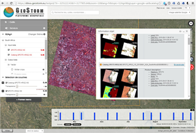

> __Customer__\: Ben-Gurion University of the Negev (BGU)

> __Program__\: Venμs

> __Supply Chain__\: BGU >  CS Group PDA

# Context

The mission VENµS (Vegetation and Environment monitoring on a New Micro Satellite) is the result of cooperation between France and Israel. 
This mission has two objectives:
* the technological mission led by Israel aims to demonstrate the capabilities of the IHET (Israeli Hall Effect Thruster)
* The scientific mission led by CNES aims to acquire high-resolution multispectral images at two-day intervals for applications in a variety of fields (agriculture, forestry, atmospheric studies, etc.) 
Three levels of products VENµS can thus be made available to the scientific community:
* level 1 (L1) products: multispectral images by TOA (Top Of Atmosphere) reflectance after radiometric corrections, calibrated and geocoded.
* Level 2 products (L2): multispectral images by surface reflectance after atmospheric corrections accompanied by qualitative masks (clouds, snow, water, etc.).
* Level 3 products (L3): multi-temporal synthesis of cloudless pixels from cloud-free products.
The Ben Gurion University of the Negev, within the framework of this cooperation, wishes to produce its own L2 and L3 images from the L1 data provided by CNES.

CS Group responsabilities are as follow:
* specification, development, on-site integration, 
* user manual authoring, support (training) 
* maintenance of the BIP workflow and BIP data catalog

The features are as follow:
* __The BIP workflow__: creation of an image processing chain management tool based on Geostorm workflow technology and control of the MACCS software, enabling the production of levels L2 and L3.
* __The BIP data catalog__: realization of a data catalog based on the GeoNetwork web technology, allowing to browse the metadata of the L2 and L3 products, as well as to view overviews and rights-of-way of these same products, all on a cartographic background of Israel.

# Project implementation

The project objectives are as follow:
* Produce BGU's L2 and L3 images from the L1 data provided by CNES

The processes for carrying out the project are:
* Software V-Model

# Technical characteristics

The solution key points are as follow:
* Expertise in satellite imagery applied to various themes: agriculture, environment, land use planning, natural risks, etc.
* Ability to integrate MACCS (developed by CS for CNES) into a processing chain..
* Skills in the development of production chain management tools and open-source web technologies.

The main technologies are as follow.

{:class="table table-bordered table-dark"}
| Domain | Technologie(s) |
|--------|----------------|
|Operating System(s)|Linux|
|Programming language(s)|Python, Java, J2EE/WS, HTML, Javascript|
|Interoperability (protocols, format, APIs)|XML, GeoNetwork|
|Production software (IDE, DEVOPS etc.)|Git, Docker, Jenkins|
|Main COTS library(ies)|MACCS (Multi-mission Atmospheric Correction and Cloud Screening), Geostorm|

{::comment}Abbreviations{:/comment}

*[CLI]: Command Line Interface
*[IaC]: Infrastructure as Code
*[PaaS]: Platform as a Service
*[VM]: Virtual Machine
*[OS]: Operating System
*[IAM]: Identity and Access Management
*[SIEM]: Security Information and Event Management
*[SSO]: Single Sign On
*[IDS]: intrusion detection
*[IPS]: intrusion prevention
*[NSM]: network security monitoring
*[DRMAA]: Distributed Resource Management Application API is a high-level Open Grid Forum API specification for the submission and control of jobs to a Distributed Resource Management (DRM) system, such as a Cluster or Grid computing infrastructure.
