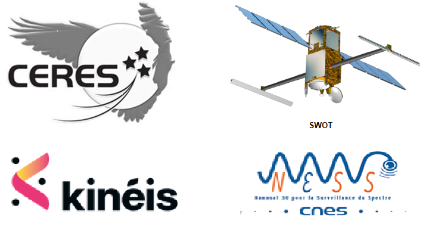

> __Customer__\: Centre National d'Etudes Spatiales (CNES)

> __Programme__\: Multi-missions

> __Supply Chain__\: CNES >  CS Group SPACE

# Context

CS Group responsabilities for Assistance to ISIS Project Management for CERES, SWOT, MERLIN, N3SS and KINEIS missions are as follows:
* * Support piloted by CNES

The features are as follows:
* **Maintenance of ISIS technical specifications**
	**BDS** and **interfaces** management (XML and XIF schemas)
	**Technical management of subsystems**: follow-up of production (anomalies, patches, versions)
* Participation in ISIS reviews, technical and coordination meetings
* Contribution to **industrial revenue**
* Participation in **AIV and systems tests**: qualification of the TM/TC chain: BD Satellite generation, LdP configuration
	**Support to Operations**: participation in the launch, in-flight acceptance and start of life

# Project implementation

The project objectives are as follows:
* Engineering and AMOA support for Satellite Control Ground Segments implementing the ISIS Command Control Center Product Line

The processes for carrying out the project are:
* Requirements management (STB, IF): Doors
* Qualification system tests of control ground segments: Compatibility, Technical and Operational Qualification

# Technical characteristics

The solution key points are as follows:
* Control Center Architecture Engineering
* Operational qualification of TM/TC ISIS chains: BDS configurations, sessions, SLE, COP, catalogs, TM visualization, TC histo
* AMOA team made up of experienced resources

The main technologies used in this project are:

{:class="table table-bordered table-dark"}
| Domain | Technology(ies) |
|--------|----------------|
|Hardware environment(s)|Esx Dell, SAN, Appliance Netbackup, HP Thin Pro, switch, firewall|
|Operating System(s)|Red Hat 7.5, VMWare, NoMachine,  PXE|
|Programming language(s)|Python, Bash|
|Interoperability (protocols, format, APIs)|XML, XTCE, Jason, CCSDS,  standard CNES XIF|
|Production software (IDE, DEVOPS etc.)|JIRA, Git, Ansible, Doors|
|Main COTS library(ies)|Ldap, IDM, ZeroMQ, SGBD|

{::comment}Abbreviations{:/comment}

*[CLI]: Command Line Interface
*[IaC]: Infrastructure as Code
*[PaaS]: Platform as a Service
*[VM]: Virtual Machine
*[OS]: Operating System
*[IAM]: Identity and Access Management
*[SIEM]: Security Information and Event Management
*[SSO]: Single Sign On
*[IDS]: intrusion detection
*[IPS]: intrusion prevention
*[NSM]: network security monitoring
*[DRMAA]: Distributed Resource Management Application API is a high-level Open Grid Forum API specification for the submission and control of jobs to a Distributed Resource Management (DRM) system, such as a Cluster or Grid computing infrastructure.
