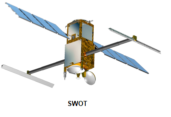

> __Customer__\: Centre National d'Etudes Spatiales (CNES)

> __Programme__\: SWOT

> __Supply Chain__\: CNES >  CS Group SPACE

# Context

CS Group responsabilities for Support in Task Delegation of MCO and Ground Operations of CCC ISIS Science are as follows:
* * Management of ground support for operations in Task Delegation by CS GROUP

The features are as follows:
* **Delegation of tasks for ground support in routine operation**: MCO and support for operations (shifts, on-call), support for tests, management of the Cluster Sciences Platform, integration and qualification of new LdP versions
	**Contribution to the shared AIV ISIS (MIG), to the shared exploitation layer (PULP) and to the AIV ClusterSciences**: AIV and testing of new versions of LdP, integration of new missions
	**Task delegation**: support for the definition, implementation and technical management of operations assistance tools

# Project implementation

The project objectives are as follows:
* Delegation of tasks for MRO and routine ground operations for scientific or civil missions based on the ISIS Product Line: SWOT missions, N3SS, ...

The processes for carrying out the project are:
* Specific Process for Assembly, Integration, Validation Qualification of Control Ground Segments
* Qualification system tests of control ground segments: Compatibility, Technical and Operational Qualification

# Technical characteristics

The solution key points are as follows:
* Deployment of virtualized architecture, equipment, costs, security
* Configuration and deployment of CCCs and SCPs/SSVs (experts) and test lines (Onboard, Ground, FDS users)
* Spatial databases/Systems: DB generation, LdP configuration, TM/TC qualification
* Highly experienced team (ISIS experts)

The main technologies used in this project are:

{:class="table table-bordered table-dark"}
| Domain | Technology(ies) |
|--------|----------------|
|Hardware environment(s)|Esx Dell, SAN, Appliance Netbackup, HP Thin Pro, switch, firewall|
|Operating System(s)|Red Hat 7.5, VMWare, NoMachine,  PXE, Nutanix|
|Programming language(s)|Python, Bash|
|Interoperability (protocols, format, APIs)|XML, XTCE, Jason, CCSDS, standard CNES XIF|
|Production software (IDE, DEVOPS etc.)|JIRA, Git, Ansible|
|Main COTS library(ies)|Ldap, IDM, ZeroMQ, SGBD|

{::comment}Abbreviations{:/comment}

*[CLI]: Command Line Interface
*[IaC]: Infrastructure as Code
*[PaaS]: Platform as a Service
*[VM]: Virtual Machine
*[OS]: Operating System
*[IAM]: Identity and Access Management
*[SIEM]: Security Information and Event Management
*[SSO]: Single Sign On
*[IDS]: intrusion detection
*[IPS]: intrusion prevention
*[NSM]: network security monitoring
*[DRMAA]: Distributed Resource Management Application API is a high-level Open Grid Forum API specification for the submission and control of jobs to a Distributed Resource Management (DRM) system, such as a Cluster or Grid computing infrastructure.
