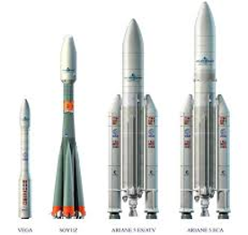
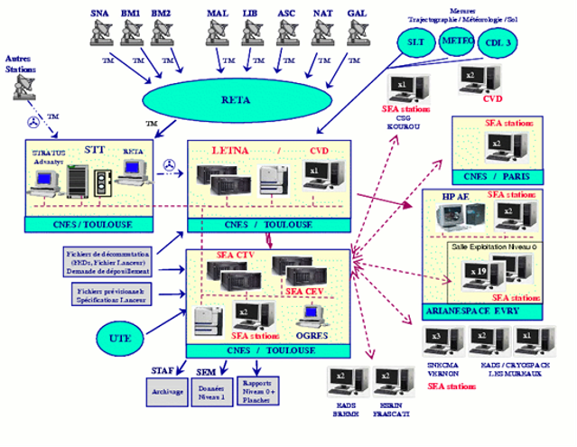

> __Customer__\: Centre National d'Etudes Spatiales (CNES)

> __Programme__\: Ariane

> __Supply Chain__\: CNES >  CS Group SPACE

# Context

CS Group responsabilities for Telemetry Processing Centre are as follows:
* Design, Development, Integration, hardware migration, Maintenance, Operation support
* Launchers telemetry deep expertise

The features are as follows:
* LETNA (ARIANESPACE's Digital Telemetry Operating Software), in CNES Toulouse:  Telemetry processing including autonomous TMs.
* CVD (Delayed Visual Control), in Guiana Space Center: reactive availability of visual analysis reports.
* SEA (Ariane Operating System): decision making software for manufacturers experts on the conformity of their subsystems.

# Project implementation

The project objectives are as follows:
* Telemetry processing for ARIANE5, VEGA and SOYOUZ launchers
* Systematic use of the center for each launch for the benefit of the ARIANESPACE customer

The processes for carrying out the project are:
* V-Cycle

# Technical characteristics

The solution key points are as follows:
* Local application

The main technologies used in this project are:

{:class="table table-bordered table-dark"}
| Domain | Technology(ies) |
|--------|----------------|
|Hardware environment(s)|PC|
|Operating System(s)|Linux Redhat 5.3 secured|
|Programming language(s)|C, C++,PRO*C FORTRAN, WAVE|
|Interoperability (protocols, format, APIs)|Kerberos LDAP|
|Production software (IDE, DEVOPS etc.)|Mercurial, Eclipse, TRAC|
|Main COTS library(ies)|Oracle Database, CNES Ogres, CNES PrestoPlot, CNES STAF, CNES SEM, Nagios|

{::comment}Abbreviations{:/comment}

*[CLI]: Command Line Interface
*[IaC]: Infrastructure as Code
*[PaaS]: Platform as a Service
*[VM]: Virtual Machine
*[OS]: Operating System
*[IAM]: Identity and Access Management
*[SIEM]: Security Information and Event Management
*[SSO]: Single Sign On
*[IDS]: intrusion detection
*[IPS]: intrusion prevention
*[NSM]: network security monitoring
*[DRMAA]: Distributed Resource Management Application API is a high-level Open Grid Forum API specification for the submission and control of jobs to a Distributed Resource Management (DRM) system, such as a Cluster or Grid computing infrastructure.
