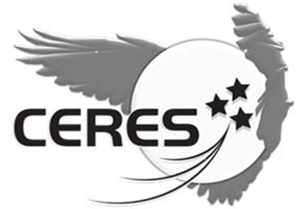

> __Customer__\: Centre National d'Etudes Spatiales (CNES)

> __Programme__\: CERES

> __Supply Chain__\: CNES >  CS Group SPACE

# Context

CS Group responsabilities for Assistance to project management for the drafting of CERES specifications are as follows:
* service managed by CNES

The features are as follows:
* Respond to needs expressed at the system level while respecting the scope of the ISIS Product Line which defines the new CNES CCC standards.

# Project implementation

The project objectives are as follows:
* Analysis of mission working documents (STB CERES system) and reference documents (DR) ISIS and CSO
* Identification of technical choices for arbitration by the CNES ground and system teams
* Drafting of CERES CCC level documents

The processes for carrying out the project are:
* Requirements engineering

# Technical characteristics

The solution key points are as follows:
* In a team integrated into CNES
* CERES: 1st instantiation of the ISIS product line

The main technologies used in this project are:

{:class="table table-bordered table-dark"}
| Domain | Technology(ies) |
|--------|----------------|
|Hardware environment(s)|PC|
|Operating System(s)|Windows|

{::comment}Abbreviations{:/comment}

*[CLI]: Command Line Interface
*[IaC]: Infrastructure as Code
*[PaaS]: Platform as a Service
*[VM]: Virtual Machine
*[OS]: Operating System
*[IAM]: Identity and Access Management
*[SIEM]: Security Information and Event Management
*[SSO]: Single Sign On
*[IDS]: intrusion detection
*[IPS]: intrusion prevention
*[NSM]: network security monitoring
*[DRMAA]: Distributed Resource Management Application API is a high-level Open Grid Forum API specification for the submission and control of jobs to a Distributed Resource Management (DRM) system, such as a Cluster or Grid computing infrastructure.
