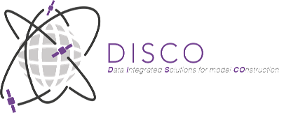
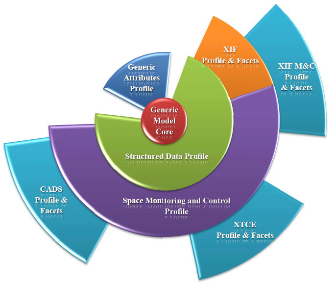

> __Customer__\: Centre National d'Etudes Spatiales (CNES)

> __Programme__\: Generic

> __Supply Chain__\: CNES >  CS Group PDA

# Context

DISCO meets two main challenges:
Handling concepts which format is mutable and which can carry properties from different formats.
Providing good performances and a smooth user experience on complex big-sized models.
To address them, the modeler is based on:
An approach based on domain-oriented profiles, which add new concepts to the generic core, enriching the metamodel in a non-intrusive way.
The EMF Facet technology, which lets us add new derived attributes to enrich the existing metamodels in a non-intrusive way.
With this technology, the modeler can manipulate generic data descriptions, without the domain-specific or format-oriented aspects. A lazy-loading policy to this organization will provide an easy way to navigate model, without the need of loading aspect-specific details of an element in memory. These specific details are required only by high level layers and can be loaded only when explicitly needed.
Thus, the modeler’s core is not specialized for any specific business domain. This allows a generic modeler, which can be used whatever the user’s domain is. This modeler can be derived for various specific business domains, in higher layers. The core is also separated in various components, each with a specific role, accordingly with the separation of concerns approach. This approach gives more extensibility to the modeler. As an example, the modeler’s core does not care about how the model is persisted, relying only on EMF ; thus various persistence solutions can be chosen in the very same tool (local file persistence or externalized to a dedicated server for bigger models).
The high level specific layers will address only the spatial business domain at the beginning in order to address directly the needs formalized by CNES.

CS Group responsabilities for Data Integrated Solutions for model COnstruction are as follows:
* * Design, Development
	* EPL license

The features are as follows:
* Generic model adaptable to any business domain ontology and providing transcriptions to different formats
* Common Monitoring and Control representation based on the generic model : XIF/XTCE/CADS standard interoperability, export from common model and conversion
* Sustainable description model
* Complex and big descriptions management
* High level adaptability : framework configuration, concepts of facets and stereotypes
* High level extensibility : many persistence solutions

# Project implementation

The project objectives are as follows:
* Easy manipulation of data descriptions, which size is nowadays always bigger
* Using a single model, while exporting and importing from different description formats
* Being able to use the modeler, whatever the business domain described by the formats

The processes for carrying out the project are:
* Continuous Integration

# Technical characteristics

The solution key points are as follows:
* Model Driven Engineering
* Eclipse Technologies
* Space Database/Space segment systems
* Formats: XIF, XTCE, CADS
* Standards: XTCE Standard, ISIS (Initiative for Space Innovative Standards), CNES XIF internal standard, CCSDS EAST and DEDSL standards

The main technologies used in this project are:

{:class="table table-bordered table-dark"}
| Domain | Technology(ies) |
|--------|----------------|
|Hardware environment(s)|PC|
|Operating System(s)|Windows|
|Programming language(s)|Java, Xtend, Xtext|
|Interoperability (protocols, format, APIs)|XML|
|Production software (IDE, DEVOPS etc.)|Eclipse, Eclipse Modeling technologies based on EMF, CDO, Apache Maven, Git, Subversion, Junit, Jenkins, SonarQube|

{::comment}Abbreviations{:/comment}

*[CLI]: Command Line Interface
*[IaC]: Infrastructure as Code
*[PaaS]: Platform as a Service
*[VM]: Virtual Machine
*[OS]: Operating System
*[IAM]: Identity and Access Management
*[SIEM]: Security Information and Event Management
*[SSO]: Single Sign On
*[IDS]: intrusion detection
*[IPS]: intrusion prevention
*[NSM]: network security monitoring
*[DRMAA]: Distributed Resource Management Application API is a high-level Open Grid Forum API specification for the submission and control of jobs to a Distributed Resource Management (DRM) system, such as a Cluster or Grid computing infrastructure.
