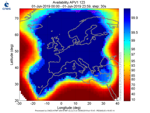

> __Customer__\: Centre National d'Etudes Spatiales (CNES)

> __Programme__\: Generic

> __Supply Chain__\: CNES >  CS Group SPACE

# Context

CS Group responsabilities for GNSS Positioning and Timing Observatory are as follows:
* Developpment, Project management

The features are as follows:
* **Recent evolutions** :
* Calcul of instantaneous and associated statistical URE (user range error) by satellite
* Tropospheric delay models
* BeiDou implementation
* Doppler measurement modelization
* Receiver velocity and clock receiver drift computation by using Doppler measurement
* Kouba attitude model integration
* Computation of weighted PVT
* Compatibility with Rinex 3.2 format
* Galileo latency computation
* Adaptation for NTMF (Navigation and Timing Monitoring Facility) project

# Project implementation

The project objectives are as follows:
* Adaptive and corrective maintenance of the GPTO software
* GPTO is a set of elementary tools allowing to analyze GNSS measurements quality and EGNOS system performance

The processes for carrying out the project are:
* V Cycle

# Technical characteristics

The solution key points are as follows:
* Adequately skilled support, permanently available for client requets
* Maintenance adapted to the customer needs
* Technical excellence
* Very good responsiveness to customer requests

The main technologies used in this project are:

{:class="table table-bordered table-dark"}
| Domain | Technology(ies) |
|--------|----------------|
|Hardware environment(s)|Linux (Red Hat 5, 6 et 7) , Windows|
|Programming language(s)|ADA, C, F77, F90, Shell, Perl|
|Production software (IDE, DEVOPS etc.)|Scilab|

{::comment}Abbreviations{:/comment}

*[CLI]: Command Line Interface
*[IaC]: Infrastructure as Code
*[PaaS]: Platform as a Service
*[VM]: Virtual Machine
*[OS]: Operating System
*[IAM]: Identity and Access Management
*[SIEM]: Security Information and Event Management
*[SSO]: Single Sign On
*[IDS]: intrusion detection
*[IPS]: intrusion prevention
*[NSM]: network security monitoring
*[DRMAA]: Distributed Resource Management Application API is a high-level Open Grid Forum API specification for the submission and control of jobs to a Distributed Resource Management (DRM) system, such as a Cluster or Grid computing infrastructure.
