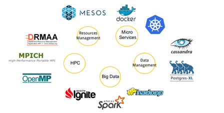

> __Customer__\: Centre National d'Etudes Spatiales (CNES)

> __Programme__\: CO3D

> __Supply Chain__\: CNES >  CS Group SPACE

# Context

CS Group responsabilities for 3D Optical Constellation image chain CO3D are as follows:
* Design, Development, Integration and Maintenance,
* Open source Promoter.

The features are as follows:
* Deployment of a processing chain (S2P: Satellite Stereo Pipeline) in a multi-cloud environment
* Performance & cost optimization
* Creation of the DevOps pipeline

# Project implementation

The project objectives are as follows:
* Technical & financial evaluation of a Earth observation image processing chain in cloud environment

The processes for carrying out the project are:
* Agile, Continuous integration

# Technical characteristics

The solution key points are as follows:
* On-demand computing platform creation service 
* Useful service deployments without the complexity of managing a processing platform over a cloud infrastructure (WPS Service)

The main technologies used in this project are:

{:class="table table-bordered table-dark"}
| Domain | Technology(ies) |
|--------|----------------|
|Hardware environment(s)|Cloud (HPC)|
|Operating System(s)|Linux|
|Programming language(s)|GO, Python|
|Interoperability (protocols, format, APIs)|Big Data, Protocols WPS|
|Production software (IDE, DEVOPS etc.)|Gitlab, Apache Spark, SafeScale, Docker, go test for Go - unittest for Python, Docker - Apache Ignite, Stack ELK|
|Main COTS library(ies)|S2P (QTIS)|

{::comment}Abbreviations{:/comment}

*[CLI]: Command Line Interface
*[IaC]: Infrastructure as Code
*[PaaS]: Platform as a Service
*[VM]: Virtual Machine
*[OS]: Operating System
*[IAM]: Identity and Access Management
*[SIEM]: Security Information and Event Management
*[SSO]: Single Sign On
*[IDS]: intrusion detection
*[IPS]: intrusion prevention
*[NSM]: network security monitoring
*[DRMAA]: Distributed Resource Management Application API is a high-level Open Grid Forum API specification for the submission and control of jobs to a Distributed Resource Management (DRM) system, such as a Cluster or Grid computing infrastructure.
