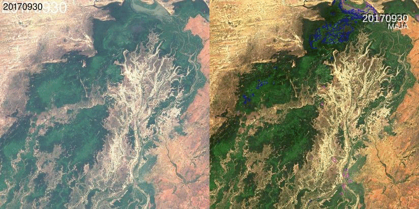
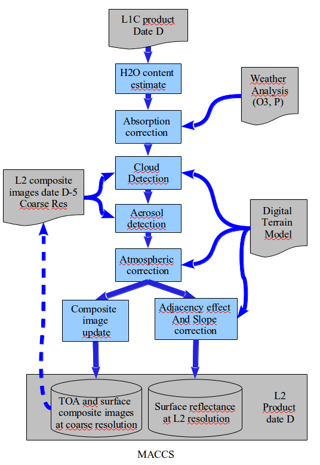

> __Customer__\: Centre National des Etudes Spatiales (CNES)

> __Programme__\: Generic

> __Supply Chain__\: CNES >  CS Group PDA

# Context

MAJA (MACCS ATCOR Joint Algorthm) is a level 2A processing chain that:
* detects clouds and their shadows, 
* estimates the optical thickness of aerosols, the amount of water vapour, 
* corrects atmospheric effects. 

Historically the MACCS (Multi-sensor Atmospheric Correction and Cloud Screening) chain was developed jointly by CESBIO and CNES for Venus mission and extend progressively to other missions (SPOT-5, Formosat-2, Landsat 5, 7, 8 and Sentinel-2A/B). CESBIO design the algorithms and develop a prototype, while CNES took in charge the operational version of the chain, which CESBIO largely contributed to validate. More recently, CNES+CESBIO and DLR decided to pool their efforts to develop the MAJA chain (MACCS-ATCOR Joint Algorithm). This chain is an evolution of the MACCS chain in which methods from the DLR's ATCOR chain will be progressively added. In order to celebrate this agreement, MACCS 6.0 version has been renamed to MAJA V1.0.

The MAJA chain (currently V3.X) is used operationally by the [THEIA initiative](https://www.theia-land.fr/) in the [CNES MUSCATE production centre](https://theia.cnes.fr). 

MAJA 4.X will be relased in open source in 2020 with a new architecture which allow better integration with OTB and possibility to CESBIO and other researchers to reuse and update algorithms.

MAJA is now used on multiple programs, including Venus, Sentinel2, Landsat, Formosat-2, SPOT5.

CS promotes the MAJA chain as a product (cf. [MAJA](https://pda.csgroup.space/product-maja.html))

CS Group responsabilities are as follows:
* Algorithms development and validation into MAJA or OTB based on CESBIO ATBB.
* Develop new functionnalities or interfaces (new sensors or product format).
* Improve processing performance.
* Maintain and support integration of MAJA in CNES operational context

The features are as follows:
* Detect clouds and clouds shadows
* Detect snow and water bodies 
* Estimate atmospheric and aerosol parameters
* Perform atmospheric correction on Earth Observation product
* Perform envrionmental and topograpic correction Earth Observation product

# Project implementation

The project objectives are as follows:
* Develop and maintain an up to date and operational processing chain to generate L2A EO products

The processes for carrying out the project are:
* Iterative development
* Continuous development and integration (coding/unit testing)
* Automatic Test Plan Generator with test execution and insertion of results in a CDash instance

# Technical characteristics

The solution key points are as follows:
* C++ software build on OTB libraries
* Python
* CMake/CTest/CDash
* Multiple plugin handling using generic factories

The main technologies used in this project are:

{:class="table table-bordered table-dark"}
| Domain | Technology(ies) |
|--------|----------------|
|Operating System(s)|Linux 64 bits, RedHat/CentOS 7./8., Ubuntu 18.04|
|Programming language(s)|C++, Python|
|Interoperability (protocols, format, APIs)|SENTINEL SAFE, MUSCATE, LANDSAT product format|
|Production software (IDE, DEVOPS etc.)|GCC|
|Main COTS library(ies)|ORFEO Tool Box (OTB), Intersecteur3D, GDAL, HDF, OpenJPEG|

{::comment}Abbreviations{:/comment}

*[CLI]: Command Line Interface
*[IaC]: Infrastructure as Code
*[PaaS]: Platform as a Service
*[VM]: Virtual Machine
*[OS]: Operating System
*[IAM]: Identity and Access Management
*[SIEM]: Security Information and Event Management
*[SSO]: Single Sign On
*[IDS]: intrusion detection
*[IPS]: intrusion prevention
*[NSM]: network security monitoring
*[DRMAA]: Distributed Resource Management Application API is a high-level Open Grid Forum API specification for the submission and control of jobs to a Distributed Resource Management (DRM) system, such as a Cluster or Grid computing infrastructure.
