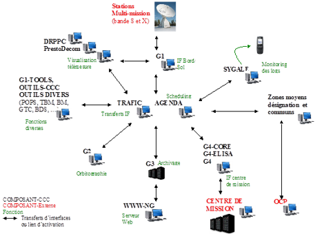

> __Customer__\: Centre National d'Etudes Spatiales (CNES)

> __Programme__\: Mini/Micro-satellites

> __Supply Chain__\: CNES >  CS Group SPACE

# Context

**Challenge : **
* Maintaining competence over a very long maintenance period
* Sustainable teams
* Reactivity for taking into account anomalies and requests for changes in order to meet operational constraints

CS Group responsabilities for Third Party Application Maintenance of Mini-Micro Control Centers are as follows:
* Development, Validation, Maintenance

The features are as follows:
* **G1, G1-Tools** : Functions of On-Board/Ground Interface
	**G2** : Orbit and Attitude Calculation
	**G3** : Archiving and Data Operations
	**G4** : Exchange of interface files with the Mission Centers
	**DRPPC** : Telemetry display and replay
	**SWWW-NG** : Access to data stored on G3
	**Outils-CCC** : Bringing together various tools at CCC level
	**TBM** : Encoding and decoding tables beside the MYRIADE
	**POPS**  : Programming the planning of Mini or Micro operations
	**GTC** : Generation of PARASOL TC.

# Project implementation

The project objectives are as follows:
* Third-party application maintenance of the Mini-Micro satellites Ground Segment

The processes for carrying out the project are:
* V Cycle,

# Technical characteristics

The solution key points are as follows:
* Criticality, availability and robustness of the system

The main technologies used in this project are:

{:class="table table-bordered table-dark"}
| Domain | Technology(ies) |
|--------|----------------|
|Hardware environment(s)|Linux PC, Windows PC|
|Operating System(s)|Redhat Enterprise Linux 5 (secured), CentOS 6.6|
|Programming language(s)|C, C++, Java, Perl, Tcl/Tk, Python, Delphi|
|Production software (IDE, DEVOPS etc.)|Visual C++, SLGMS, Ant, Maven, SVN, TestLink,  UML (Rational / Pink) partially|

{::comment}Abbreviations{:/comment}

*[CLI]: Command Line Interface
*[IaC]: Infrastructure as Code
*[PaaS]: Platform as a Service
*[VM]: Virtual Machine
*[OS]: Operating System
*[IAM]: Identity and Access Management
*[SIEM]: Security Information and Event Management
*[SSO]: Single Sign On
*[IDS]: intrusion detection
*[IPS]: intrusion prevention
*[NSM]: network security monitoring
*[DRMAA]: Distributed Resource Management Application API is a high-level Open Grid Forum API specification for the submission and control of jobs to a Distributed Resource Management (DRM) system, such as a Cluster or Grid computing infrastructure.
