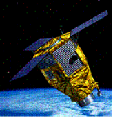

> __Customer__\: Centre National d'Etudes Spatiales, Airbus Defense & Space (CNES)

> __Programme__\: Pléiades

> __Supply Chain__\: CNES > AIRBUS DS >  CS Group SPACE

# Context

CS Group responsabilities for TMA PLEIADES Programming Chain are as follows:
* Responsibility in co-contracting, project manager

The features are as follows:
* Programming Unit: image requests, program requests, receiving stations
* Access Unit: user access interface
* DUPC Unit: satellite commands, CU data
* PCME Unit: international defense programming 
* Processing Unit: TMI inventory and archiving
* ImageReceivingStation Unit: receiving and ingesting TMI
* AccurateAttitudeDataRestoration Unit: fine attitude data
* CommandControl Unit: system and satellite settings
* Integration of PHRLIB/GOTLIB mission libraries

# Project implementation

The project objectives are as follows:
* Development: engineering phases, software specifications, preliminary and detailed design, coding and unit testing, unit and AIV validation, acceptance, warranty,
* MCO: correction of anomalies and development of numerous functional evolutions.

The processes for carrying out the project are:
* V Cycle

# Technical characteristics

The solution key points are as follows:
* Highly deployed architecture, more than 200 XML file interfaces, Web Services
* Complexity of mission algorithms, performance requirements
* Civil/defense duality
* Ground operating life of 25 years

The main technologies used in this project are:

{:class="table table-bordered table-dark"}
| Domain | Technology(ies) |
|--------|----------------|
|Operating System(s)|Linux, XP|
|Programming language(s)|C++, Java|
|Production software (IDE, DEVOPS etc.)|Oracle spatial, SIG OpenMap, Web Services ,Apache/Tomcat/Axis, Kerbéros/LDAP ,Java web start, Xerces|
|Main COTS library(ies)|45 cots|

{::comment}Abbreviations{:/comment}

*[CLI]: Command Line Interface
*[IaC]: Infrastructure as Code
*[PaaS]: Platform as a Service
*[VM]: Virtual Machine
*[OS]: Operating System
*[IAM]: Identity and Access Management
*[SIEM]: Security Information and Event Management
*[SSO]: Single Sign On
*[IDS]: intrusion detection
*[IPS]: intrusion prevention
*[NSM]: network security monitoring
*[DRMAA]: Distributed Resource Management Application API is a high-level Open Grid Forum API specification for the submission and control of jobs to a Distributed Resource Management (DRM) system, such as a Cluster or Grid computing infrastructure.
