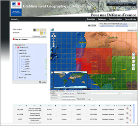

> __Customer__\: DGA - Ministère de la Défense (DGA)

> __Programme__\: DNG3D

> __Supply Chain__\: DGA >  CS Group PDA

# Context

CS Group responsabilities are as follows:
* Project manager in partnership with Magellium and Geo212

The features are as follows:
* Architecture design and distribution of activities to the partners,
* Hardware, software and equipments supply,
* Specific developments contribution (e.g.  the Information System portal),
* Validation and installation activities,
* Operators, workshop leaders and managers training,
* Integrated Logistic Support (ILS).

# Project implementation

The project objectives are as follows:
* To provide armed forces a shared and relevant cartographic reference for a common understanding of the operational conditions in the perspective of preparing/running military operations, via workshops for:
	* Production (scanned maps, vector and raster data)
	* Control and planification
	* Diffusion

The processes for carrying out the project are:
* Continuous integration

# Technical characteristics

The solution key points are as follows:
* Modern technical solution (WEB, SOA),
* Efficient software in the raster and vector data management,
* Geo-library information portal compliant with new standards,
* Environment constrained (security and performances),

The main technologies used in this project are:

{:class="table table-bordered table-dark"}
| Domain | Technology(ies) |
|--------|----------------|
|Hardware environment(s)|SUN workstations and servers, PC, Apple,|
|Operating System(s)|Solaris, Mac OS, Windows Vista|
|Programming language(s)|Java|
|Interoperability (protocols, format, APIs)|Robot d'archivage, Portail Web,|
|Production software (IDE, DEVOPS etc.)|Eclipse, TestLink, Spring|
|Main COTS library(ies)|Oracle, PostgreSQL, ESB service Mix, ESRI, Ingergraph, FME, Lorienne, GeoView, ERDAS, Nuxeo, MapServer, Udig, GeoServer, geotools, tomcat, apache, life ray, eclipse RCP (UDig)|

{::comment}Abbreviations{:/comment}

*[CLI]: Command Line Interface
*[IaC]: Infrastructure as Code
*[PaaS]: Platform as a Service
*[VM]: Virtual Machine
*[OS]: Operating System
*[IAM]: Identity and Access Management
*[SIEM]: Security Information and Event Management
*[SSO]: Single Sign On
*[IDS]: intrusion detection
*[IPS]: intrusion prevention
*[NSM]: network security monitoring
*[DRMAA]: Distributed Resource Management Application API is a high-level Open Grid Forum API specification for the submission and control of jobs to a Distributed Resource Management (DRM) system, such as a Cluster or Grid computing infrastructure.
