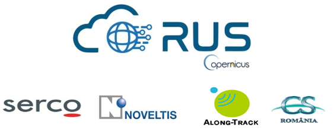
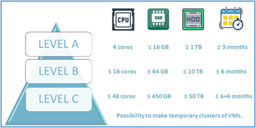

> __Customer__\: EC

> __Programme__\: Copernicus

> __Supply Chain__\: EC > ESA >  CS Group SPACE

# Context

__RUS Web Portal__: A dedicated [web portal](https://rus-opernicus.eu) is available. Users can create an account and submit a request for a preconfigured virtual machine. The Helpdesk composed of EO and IT experts can be reached via the dashboard by means of emails or chat. 

__RUS Virtual Desktop__: Preconfigured image processing environments on the Cloud provided. Software and development tools are accessiblefrom a Linux-based virtual desktop. All preinstalled softwareand tools are open source (e.g., SNAP, Sentinel toolboxes, QGIS, OTB, Python, R). Users can install their own software and tools, download, import and export data, including imagery, and scripts.

__RUS Training__: The RUS service proposes training activities in the form of on-site sessions, webinars, and materials. 
All information, videos, webinars and other materials are available for free via the RUS web portal.
Topics cover all kinds of thematic applications and Sentinel sensors. 

Follow RUS on [Twitter](https://twitter.com/RUS_Copernicus), [Facebook](https://www.facebook.com/RUSCopernicusService/), [LinkedIn](https://www.linkedin.com/groups/8623170/) or our [Website](https://rus-training.eu/) to hear about upcoming training activities and new material releases.

CS Group responsabilities for Copernicus Research and User Support are as follows:
* Works in partnership with __SERCO__, __NOVELTIS__, __Along-Track__ and __CS Romania__.
* CS EO Experts are dedicated to Sentinel-2 support

The features are as follows:
* __Free__ service to end user
* Provides __preconfigured cloud computing environments__
* __Helpdesk__ of EO experts supports users’ activities
* __Training materials__  released on a regular basis
* __Training sessions__ organized on a regular basis
* Eligible activities: R&D, teaching, pre-commercial activities

# Project implementation

The project objectives are as follows:
* Promote uptake of Copernicus data
* Support scaling up of R&D activities

The processes for carrying out the project are:
* Semi-automated scripts to deploy preconfigured virtual machines on the Cloud
* User Support through email, chat system, web portal
* Training: use of cloned virtual machines, webinars

# Technical characteristics

The solution key points are as follows:
* RUS Web Portal is a specific web application used by 2850 registered users.
* RUS Virtual Machines are preconfigured desktop-based image processing environments made available on the Cloud. A total of 1,100 VMs have been delivered so far.
* 3 default VM configurations are possible from 4 to 48 cores.

The main technologies used in this project are:

{:class="table table-bordered table-dark"}
| Domain | Technology(ies) |
|--------|----------------|
|Hardware environment(s)|Cloud VM|
|Operating System(s)|Linux|
|Programming language(s)|Ruby, HTML 5|
|Production software (IDE, DEVOPS etc.)|Redmine, RocketChat|
|Main COTS library(ies)|SNAP, Sentinel toolboxes, QGIS, OTB, Python, R|

{::comment}Abbreviations{:/comment}

*[CLI]: Command Line Interface
*[IaC]: Infrastructure as Code
*[PaaS]: Platform as a Service
*[VM]: Virtual Machine
*[OS]: Operating System
*[IAM]: Identity and Access Management
*[SIEM]: Security Information and Event Management
*[SSO]: Single Sign On
*[IDS]: intrusion detection
*[IPS]: intrusion prevention
*[NSM]: network security monitoring
*[DRMAA]: Distributed Resource Management Application API is a high-level Open Grid Forum API specification for the submission and control of jobs to a Distributed Resource Management (DRM) system, such as a Cluster or Grid computing infrastructure.
