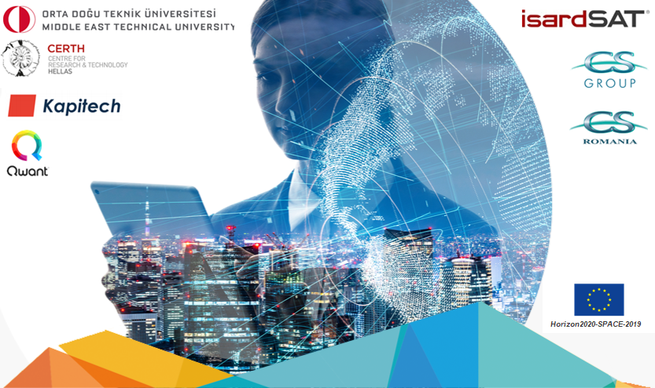
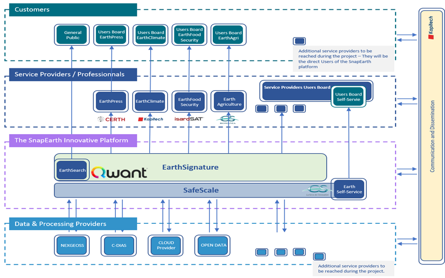

> __Customer__\: European Commission (EC)

> __Programme__\: Copernicus

> __Supply Chain__\: EC > QWANT >  CS Group PDA

# Context

CS Group responsabilities are as follows:
* Design, Development, Integration

The features are as follows:
* Index Sentinel images for easy access via a Qwant "EarthSearch" engine. 
* 4 pilot projects aim to take advantage of this indexing with the implementation of the services: Agriculture, Press, Climate and Food-Security. 
* The EarthSelf-Service enables any business or user to take advantage of highly scalable cloud environments for analysis, visualization and production of EO value-added services.

# Project implementation

The project objectives are as follows:
* Fostering EO market uptake thanks to natural and holistic access to added value data generated through cutting-edge Artificial Intelligence technologies.

The processes for carrying out the project are:
* Agile, Continuous integration

# Technical characteristics

The solution key points are as follows:
* Big data technologies and distributed cloud computing
* Access to the produced database “EarthSignature” and to satellite products
* Cloud agnosticity & multi DIAS hybridization
* Container based infrastructure with fast service deployment 
* Integrated workflow engine
* Automatic monitoring and FinOps

The main technologies used in this project are:

{:class="table table-bordered table-dark"}
| Domain | Technology(ies) |
|--------|----------------|
|Hardware environment(s)|Cloud, PaaS|
|Operating System(s)|Linux|
|Programming language(s)|Go, Python|
|Main COTS library(ies)|Kubernetes, Docker, Argo, EODAG, SafeScale, Elastic Stack, Fluentd, Graylog, Grafana|

{::comment}Abbreviations{:/comment}

*[CLI]: Command Line Interface
*[IaC]: Infrastructure as Code
*[PaaS]: Platform as a Service
*[VM]: Virtual Machine
*[OS]: Operating System
*[IAM]: Identity and Access Management
*[SIEM]: Security Information and Event Management
*[SSO]: Single Sign On
*[IDS]: intrusion detection
*[IPS]: intrusion prevention
*[NSM]: network security monitoring
*[DRMAA]: Distributed Resource Management Application API is a high-level Open Grid Forum API specification for the submission and control of jobs to a Distributed Resource Management (DRM) system, such as a Cluster or Grid computing infrastructure.
