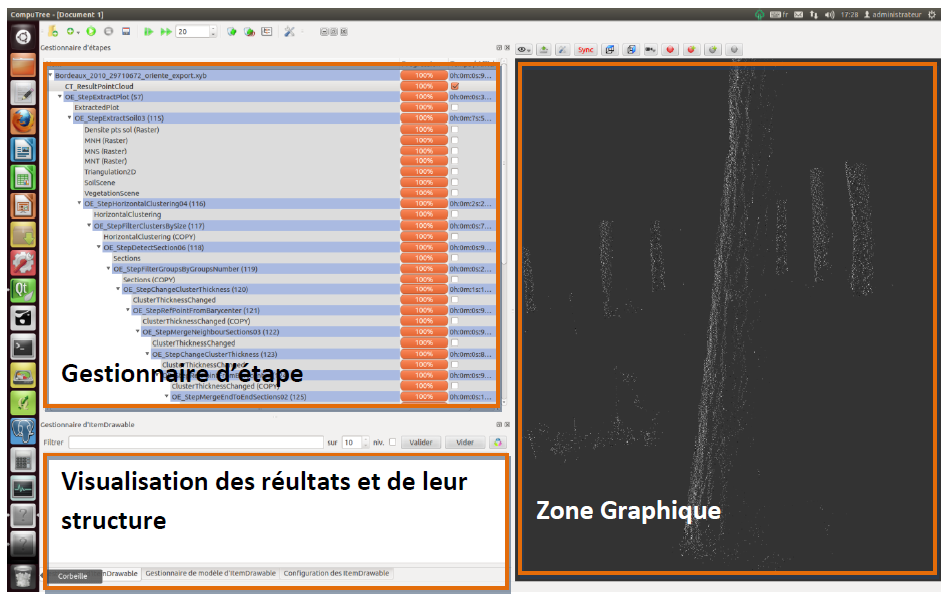
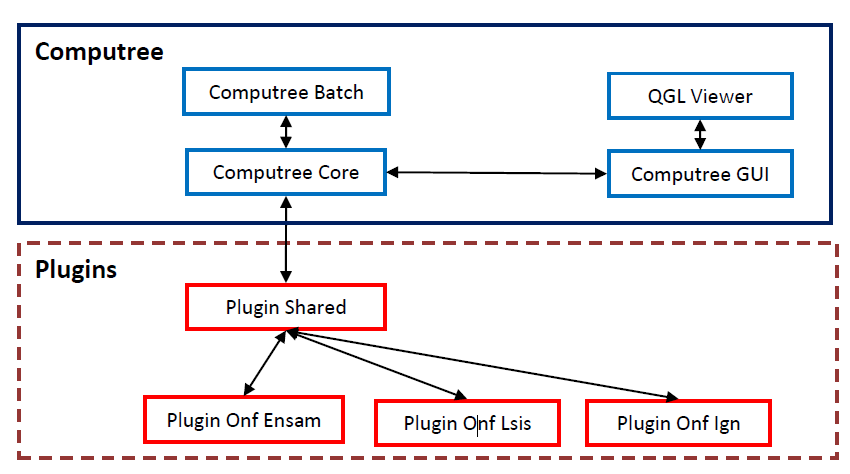

> __Customer__\: Groupement d'Intérêt Public ECOsystèmes FORestiers (ECOFOR)

> __Programme__\: Data processing platform

> __Supply Chain__\: ECOFOR >  CS Group PDA

# Context

bon

CS Group responsabilities for plateforme de traitement de données 3D Lidar are as follows:
* Plateform take over. 
* existing code assessment.maintenance operation managment(ticketing under Redmine environment). 
* procedures documentation development.
* Quality metrics Implémentation

The features are as follows:
* scans files import
* Workflow managementUn gestionnaire d’étape permettant de visualiser l’enchainement d’étapes, l'ajout et la suppression.

# Project implementation

The project objectives are as follows:
* Applicative maintenance
* Ease the use of the platform for new users
* Improve operability of the tools

The processes for carrying out the project are:
* Configuration managment

# Technical characteristics

The solution key points are as follows:
* The technical environment of the COMPUTREE project and its associated plugins is C++, with a Qt interface.
* The versioning relies on SVN for every modules, being integrated in a Redmine workbench.

The main technologies used in this project are:

{:class="table table-bordered table-dark"}
| Domain | Technology(ies) |
|--------|----------------|
|Operating System(s)|Linux, WINDOWS, MacOS|
|Programming language(s)|C++, Qt|
|Production software (IDE, DEVOPS etc.)|SVN|
|Main COTS library(ies)|Redmine|

{::comment}Abbreviations{:/comment}

*[CLI]: Command Line Interface
*[IaC]: Infrastructure as Code
*[PaaS]: Platform as a Service
*[VM]: Virtual Machine
*[OS]: Operating System
*[IAM]: Identity and Access Management
*[SIEM]: Security Information and Event Management
*[SSO]: Single Sign On
*[IDS]: intrusion detection
*[IPS]: intrusion prevention
*[NSM]: network security monitoring
*[DRMAA]: Distributed Resource Management Application API is a high-level Open Grid Forum API specification for the submission and control of jobs to a Distributed Resource Management (DRM) system, such as a Cluster or Grid computing infrastructure.
