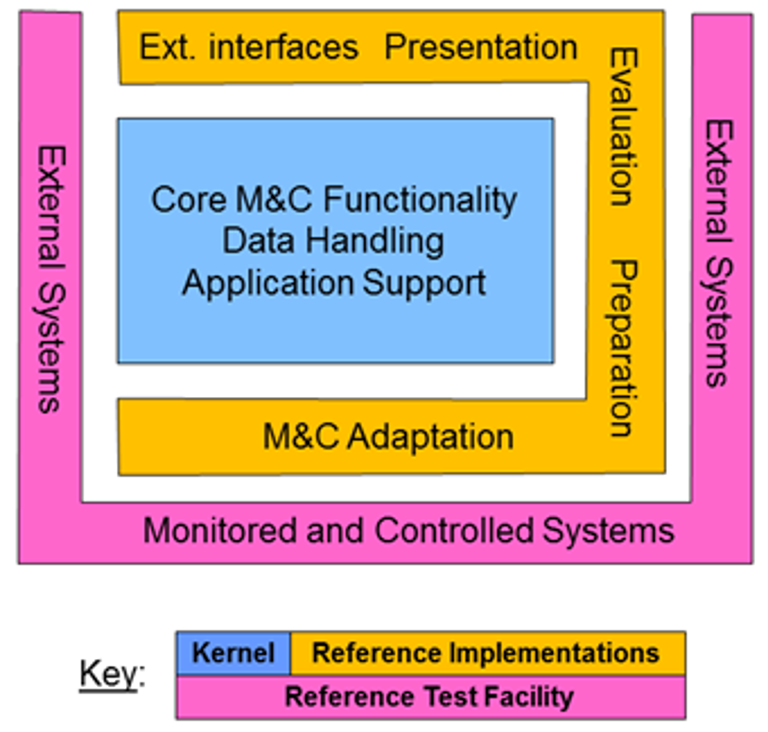
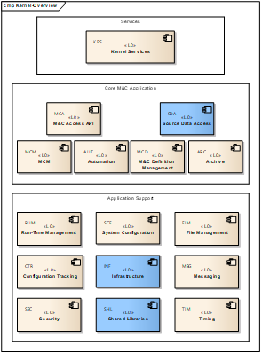

> __Customer__\: European Space Agency (ESA)

> __Programme__\: Generic

> __Supply Chain__\: ESA >  CS Group SPACE

# Context

Team: 2 to 6 persons

CS Group responsabilities for European Ground System – Common Core – Phase C/D - Development are as follows:
* Development, Maintenance

The features are as follows:
* As part of EGS-CC development consortium (led by Telespazio), CS GROUP has been involved in the implementation of data distribution and access components: __KE-INF-DD__: Data Distribution component; __KE-INF-SDA__: Source Data Access component.
* One of the key challenges of Mission Control Systems is their ability to process and transfer large amount of data in a very efficient way. Components developed by CS GROUP are based on a message-oriented middleware following a peer-to-peer approach

# Project implementation

The project objectives are as follows:
* The EGS-CC infrastructure to support monitoring and control systems is based on three layers: __Kernel__: generic M&C functionalities for any target application, and a common framework to build systems; __Reference implementations__: components that may be replaced individually; __Reference Test Facility__: test environment to support validation of EGS-CC.

The processes for carrying out the project are:
* Development cycle: the development of the EGS-CC components is based on an incremental and iterative approach. EGS-CC subsystems are  progressively assembled, integrated and validated. 
* Development environment: the EGS-CC SDE is used by all consortium members.

# Technical characteristics

The solution key points are as follows:
* Very good knowledge of the overall EGS-CC development requirements and lifecycle.
* Thorough hands-on experience with all tools of the EGS-CC SDE.
* High level of flexibility and commitment.

The main technologies used in this project are:

{:class="table table-bordered table-dark"}
| Domain | Technology(ies) |
|--------|----------------|
|Operating System(s)|Linux|
|Programming language(s)|Java|
|Production software (IDE, DEVOPS etc.)|EGS-CC SDE (Confluence, JIRA, Jenkins, Git, SonarQube), Eclipse, Maven, ZeroMQ|

{::comment}Abbreviations{:/comment}

*[CLI]: Command Line Interface
*[IaC]: Infrastructure as Code
*[PaaS]: Platform as a Service
*[VM]: Virtual Machine
*[OS]: Operating System
*[IAM]: Identity and Access Management
*[SIEM]: Security Information and Event Management
*[SSO]: Single Sign On
*[IDS]: intrusion detection
*[IPS]: intrusion prevention
*[NSM]: network security monitoring
*[DRMAA]: Distributed Resource Management Application API is a high-level Open Grid Forum API specification for the submission and control of jobs to a Distributed Resource Management (DRM) system, such as a Cluster or Grid computing infrastructure.
