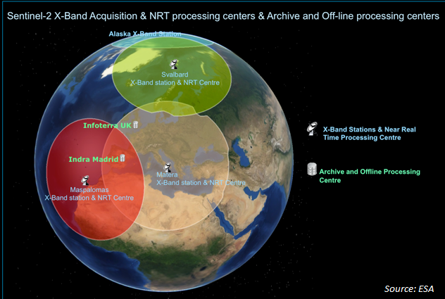
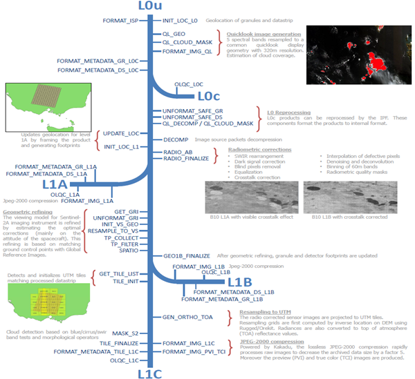

> __Customer__\: European Space Agency (ESA)

> __Programme__\: Copernicus

> __Supply Chain__\: ESA > CAP GEMINI IT. >  CS Group ESPACE

# Context

The current suite of [Sentinel missions](https://www.esa.int/Applications/Observing_the_Earth/Copernicus/The_Sentinel_missions) are at the heart of the Copernicus programme, led by the European Commission. Each Sentinel mission is based on a constellation of two satellites to fulfil revisit and coverage requirements, providing robust datasets for Copernicus services. These missions carry a range of technologies, such as radar and multi-spectral imaging instruments for land, ocean and atmospheric monitoring.

The first Copernicus space component operations have been successfully in place since the launch of Sentinel-1A in 2014, with 7 satellites currently in routine operations. The initial approach to the design and implementation of land segment operations was designed in the early 2010s. To meet emerging user needs, additional [High Priority Candidate Missions (HPCM)](https://www.esa.int/Applications/Observing_the_Earth/Copernicus/Copernicus_Sentinel_Expansion_missions), also called Expansion Missions, are to be launched between 2026 and 2028, prior to the next generation of Sentinels planned for the 2030s. 

From 2019 to 2023, ESA is carrying out a redesign of the Copernicus ground system to bring about a rationalization of interfaces between services, standardization and simplification of interfaces, minimization of interdependencies between services. This overhaul will help meet the challenges of implementing new HPCM satellites: increased data volumes, industrial independence, deployment on public clouds, etc.
    
This redesign includes the following projects:

* __CSC Coordination Desk Service__: Ground Segment Operations Configuration Coordination, Anomalies and Maintenance coordination, Mission Planning Interface Data Delivery Point Operations
* __CSC Data Distribution Service__: Data Collection from PRIP interface, Data Access for en users, monitoring, reporting
* [__CSC Data Processors re-engineering__](project-esa-data-processors-reengineering-en.html): re-engineering the current operational Level-0, Level-1 and Level-2 processors, harmonisation of the processors interfaces, revision of the processor output data packaging and format, maximisation of the use of a modular approach, open-source
* [__CSC Reference System Service__](project-esa-reference-system-en.html): Open Source Implementation of the CSC Production and Distribution functions (the RS Software), sampling reference production environment for continuous CSC Production validation, environment to benchmark and validate new processors, environment to integrate and possibly operate new data flows, access to validated and qualified processors to GS operational services.
* [__CSC Production Services__](project-esa-production-sentinel-2-en.html): encompasses all activities necessary to convert any Sentinel data acquired on XBand and EDRS into user level data available on PRIP interface, meeting the quality specification and delivering it for user access and archiving.

CS Group responsabilities for ESA CSC Production Service Sentinel 2 are as follows:
* Turnkey supply of an orchestration system for optimized image processing system: parallelization of 40 processors with a non-linear workflow, dynamic use of machines in the cloud
* Ensure level 2 support and maintenance.

The features are as follows:
* Sentinel 2 processing system:
	* XBIP ingestion
	* IPF integration
	* Spring Cloud Data Flow (SCDF) and Kafka cloud-native and open-source workflow management 
	* CEPH FS high performance storage
	* Fine tuning of processing strategy

# Project implementation

The project objectives are as follows:
* Develop and integrate the Systematic Production Service for Sentinel 2 satellite integrated in a high availability platform running 24/7
* Optimise the processing worfkow to meet SLA of 75 min for L1C and 120 minutes for L2A products with input data up to 60 GB.

The processes for carrying out the project are:
* Agile, Continuous integration

# Technical characteristics

The solution key points are as follows:
* The microservices architecture is high availability based on a managed Kubernetes cluster. The workflow is managed by Spring Cloud Data Flow, an extremely resilient message queue-based choreography system. The shared volume is implemented using a resilient, high-performance virtual file system. The project is 100% open source.

The main technologies used in this project are:

{:class="table table-bordered table-dark"}
| Domain | Technology(ies) |
|--------|----------------|
|Hardware environment(s)|cloud and K8S|
|Operating System(s)|linux CentOS|
|Programming language(s)|java, python|
|Interoperability (protocols, format, APIs)|maven, docker file, k8s yaml|
|Production software (IDE, DEVOPS etc.)|VS Code, Eclipse|
|Main COTS library(ies)|Alluxio, Apache Guacamole, Blackbox Exporter, Calico, ClamAV, Docker, ElasticSearch, Fluentbit, Fluentd, FreeIPA, Go Runtime, Grafana, Graylog, GRIB API, Harbor|

{::comment}Abbreviations{:/comment}

*[CLI]: Command Line Interface
*[IaC]: Infrastructure as Code
*[PaaS]: Platform as a Service
*[VM]: Virtual Machine
*[OS]: Operating System
*[IAM]: Identity and Access Management
*[SIEM]: Security Information and Event Management
*[SSO]: Single Sign On
*[IDS]: intrusion detection
*[IPS]: intrusion prevention
*[NSM]: network security monitoring
*[DRMAA]: Distributed Resource Management Application API is a high-level Open Grid Forum API specification for the submission and control of jobs to a Distributed Resource Management (DRM) system, such as a Cluster or Grid computing infrastructure.
