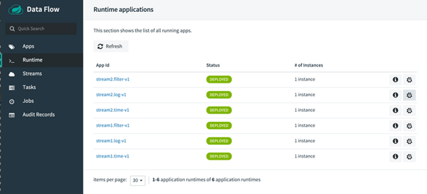
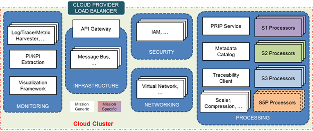

> __Customer__\: European Space Agency (ESA)

> __Programme__\: Copernicus

> __Supply Chain__\: ESA > AIRBUS DS >  CS Group ESPACE

# Context

CS Group responsabilities for ESA CSC Reference System (RS) are as follows:
* Development of infrastructure and Sentinel 2 processing chain, IVV for all satellites

The features are as follows:
* The Reference System Service provides 3 operational functions:
	* sampled systematic Production and Distribution Service;
	* ad-hoc Production and Distribution Service;
	* environment to assure the test, integration, validation, benchmarking of Sentinel Data Processors.

# Project implementation

The project objectives are as follows:
* The RS is a key component of the CSC Ground Segment: it provides to the community a complete and open source processing and distribution environment software. Integrated with the Sentinel Data Processors, it has the capacity to substitute the nominal CSC Production and Distribution services.

The processes for carrying out the project are:
* Agile, Continuous integration, DevOps, DevSecOps, GitFlow

# Technical characteristics

The solution key points are as follows:
* A micro-service architecture has proven its benefits in the past years, especially on operational systems delivering services with public access through Internet, including Commercial Public Cloud.
* It is a robust architecture relying on independent, self-deployable software components bricks.

The main technologies used in this project are:

{:class="table table-bordered table-dark"}
| Domain | Technology(ies) |
|--------|----------------|
|Hardware environment(s)|cloud and K8S|
|Operating System(s)|linux CentOS|
|Programming language(s)|java, python|
|Interoperability (protocols, format, APIs)|maven, docker file, k8s yaml|
|Production software (IDE, DEVOPS etc.)|VS Code, GitHub, Artifactory, Helm, Kubernetes, ZenHub, Ansible, Codacy|
|Main COTS library(ies)|Alluxio, AMALFI, Apache Common VFS, Apache Guacamole, Blackbox Exporter, Boost, Calico, ClamAV, CodeSynthesis XSD, CORREGSAM, Crypto++, Curator, Docker, ElasticSearch, Fftw, Fluentbit, Fluentd|

{::comment}Abbreviations{:/comment}

*[CLI]: Command Line Interface
*[IaC]: Infrastructure as Code
*[PaaS]: Platform as a Service
*[VM]: Virtual Machine
*[OS]: Operating System
*[IAM]: Identity and Access Management
*[SIEM]: Security Information and Event Management
*[SSO]: Single Sign On
*[IDS]: intrusion detection
*[IPS]: intrusion prevention
*[NSM]: network security monitoring
*[DRMAA]: Distributed Resource Management Application API is a high-level Open Grid Forum API specification for the submission and control of jobs to a Distributed Resource Management (DRM) system, such as a Cluster or Grid computing infrastructure.
