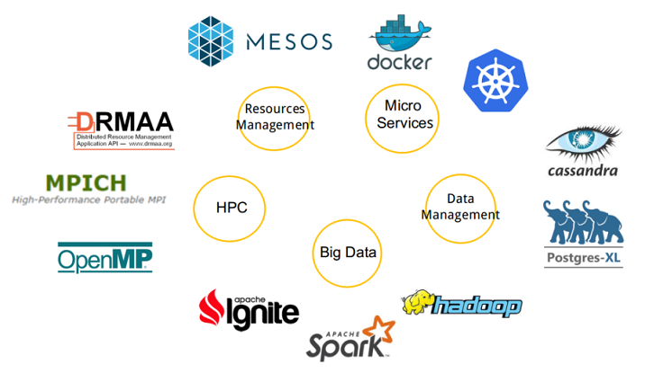

> __Customer__\: European Space Agency (ESA)

> __Programme__\: Copernicus

> __Supply Chain__\: ESA > AIRBUS DS >  CS Group PDA

# Context

CS Group responsabilities are as follows:
* Design, Development, Integration, Maintenance,
* Open source promoter.

The features are as follows:
* Migrating the IT architecture,
* Storage & processing chains,
* Ensuring Data & Services security,
* Ensuring data accessibility,
* Monitoring the processes.

# Project implementation

The project objectives are as follows:
* Migrating S1 Data & Payloads Digital Ground Segment Processing to cloud platforms

The processes for carrying out the project are:
* Agile - Continuous integration

# Technical characteristics

The solution key points are as follows:
* On-demand computing platform creation service
* Useful service deployments without the complexity of managing a processing platform over a cloud infrastructure

The main technologies used in this project are:

{:class="table table-bordered table-dark"}
| Domain | Technology(ies) |
|--------|----------------|
|Hardware environment(s)|Cloud|
|Operating System(s)|Linux|
|Programming language(s)|Java, Typescript, Go|
|Production software (IDE, DEVOPS etc.)|Docker, Gitlab, Jira, Confluence, jUnit (for Java test), Karma (for Angular test), Go test|
|Main COTS library(ies)|Angular, SafeScale, Openstack, Kafka, PostgreSQL, IPF, MongoDB, Prometheus – Fluentd – Elasticsearch – Grafana – Kibana|

{::comment}Abbreviations{:/comment}

*[CLI]: Command Line Interface
*[IaC]: Infrastructure as Code
*[PaaS]: Platform as a Service
*[VM]: Virtual Machine
*[OS]: Operating System
*[IAM]: Identity and Access Management
*[SIEM]: Security Information and Event Management
*[SSO]: Single Sign On
*[IDS]: intrusion detection
*[IPS]: intrusion prevention
*[NSM]: network security monitoring
*[DRMAA]: Distributed Resource Management Application API is a high-level Open Grid Forum API specification for the submission and control of jobs to a Distributed Resource Management (DRM) system, such as a Cluster or Grid computing infrastructure.
