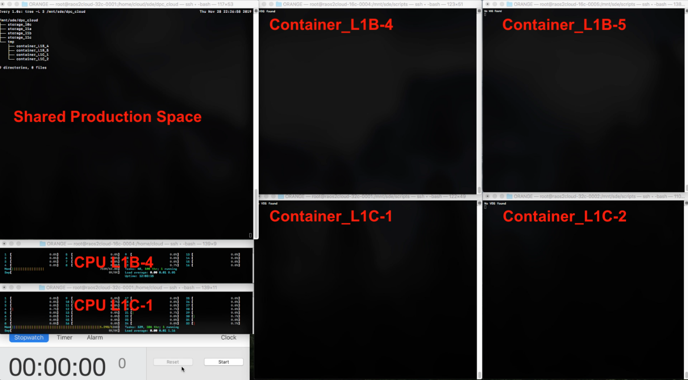
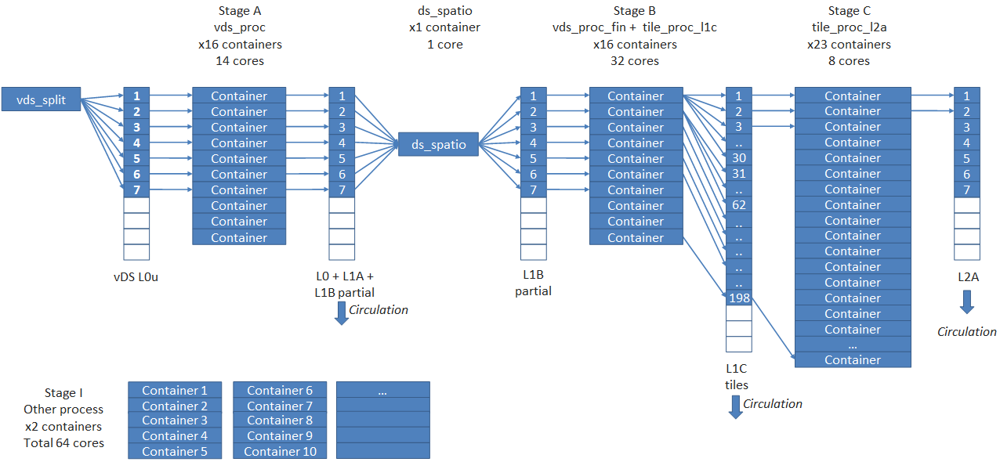

> __Customer__\: European Space Agency (ESA)

> __Programme__\: Copernicus

> __Supply Chain__\: ESA > TAS >  CS Group SPACE

# Context

CS Group responsabilities for Study of the execution of Sentinel 2 processing system on a cloud infrastructure are as follows:
* Design
* Benchmark
* Prototype Development

The features are as follows:
* Initial studies and development
* Prototype development: reads L0c DS and produces L1C vDS
* Simulation of the processing of 4-days data
* Quality impacts
* IPF Benchmarks
* Cloud provider comparison
* Performance vs price chart
* Demonstration

# Project implementation

The project objectives are as follows:
* Verify assumptions for the migration of the PDGS core processing to the cloud 
* Develop a demonstrator

The processes for carrying out the project are:
* Agile methodology

# Technical characteristics

The solution key points are as follows:
* IPFs deployed into Docker containers.
* Choreography instead of orchestration with an asynchronous messaging system.
* DS divided into smaller datastrips called vDS. Their calculation time is shorter than that of a DS.
* vDSs processed in parallel on a set of containers called "stage".

The main technologies used in this project are:

{:class="table table-bordered table-dark"}
| Domain | Technology(ies) |
|--------|----------------|
|Hardware environment(s)|Orange cc3.4xlarge.4, OVH C2-60|
|Operating System(s)|Linux|
|Programming language(s)|python|
|Interoperability (protocols, format, APIs)|S2 job orders, S2 SAFE format|
|Production software (IDE, DEVOPS etc.)|Docker, S2 IPF|

{::comment}Abbreviations{:/comment}

*[CLI]: Command Line Interface
*[IaC]: Infrastructure as Code
*[PaaS]: Platform as a Service
*[VM]: Virtual Machine
*[OS]: Operating System
*[IAM]: Identity and Access Management
*[SIEM]: Security Information and Event Management
*[SSO]: Single Sign On
*[IDS]: intrusion detection
*[IPS]: intrusion prevention
*[NSM]: network security monitoring
*[DRMAA]: Distributed Resource Management Application API is a high-level Open Grid Forum API specification for the submission and control of jobs to a Distributed Resource Management (DRM) system, such as a Cluster or Grid computing infrastructure.
