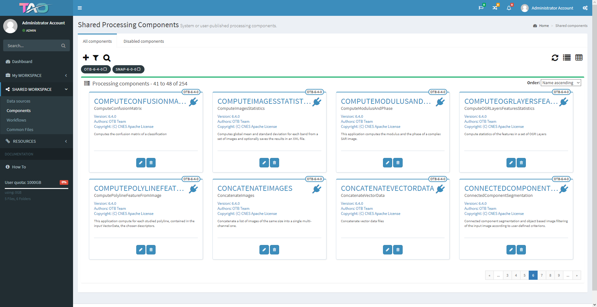
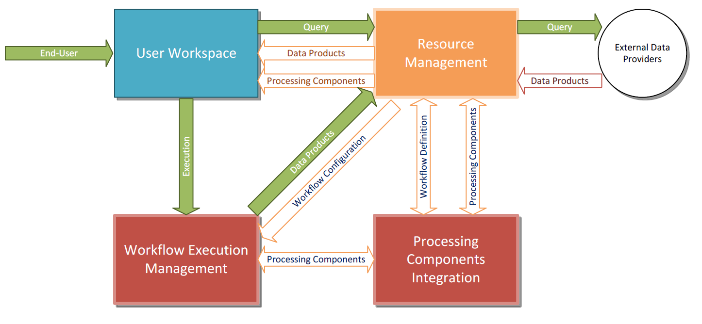

> __Customer__\: European Space Agency (ESA)

> __Programme__\: Generic

> __Supply Chain__\: ESA > CS ROMANIA >  CS Group PDA

# Context

CS Group responsabilities for Tool Augmentation by user enhancements and Orchestration are as follows:
* Project owner and the master developer (master branch)
* Specification & Design
* Maintenance

The features are as follows:
* Visual integration of EO processing toolboxes
* A pre-defined set of Docker containers for Orfeo Toolbox, SNAP, GDAL and Python 2.7
* Visual definition of processing workflows by drag-and-drop and easy parametrization 
* Integration of user-defined algorithms in the processing workflows
* Visual definition of execution topologies
* Orchestrated execution of workflows such as Torque or SLURM
* Self-contained containerized execution on remote nodes
* Basic visual monitoring of executions and topology nodes resources

# Project implementation

The project objectives are as follows:
* TAO platform (stands for Tool Augmentation by user enhancements and Orchestration) is a lightweight, generic integration and distributed orchestration framework.

The processes for carrying out the project are:
* Software V-Model

# Technical characteristics

The solution key points are as follows:
* Spring Framework
* A simple view of the TAO platform model split among four main macro-components

The main technologies used in this project are:

{:class="table table-bordered table-dark"}
| Domain | Technology(ies) |
|--------|----------------|
|Operating System(s)|Linux|
|Programming language(s)|Java, Python|
|Production software (IDE, DEVOPS etc.)|Git, Docker|
|Main COTS library(ies)|PostgreSQL, SNAP, Orfeo Toolbox, Slurm, Torque|

{::comment}Abbreviations{:/comment}

*[CLI]: Command Line Interface
*[IaC]: Infrastructure as Code
*[PaaS]: Platform as a Service
*[VM]: Virtual Machine
*[OS]: Operating System
*[IAM]: Identity and Access Management
*[SIEM]: Security Information and Event Management
*[SSO]: Single Sign On
*[IDS]: intrusion detection
*[IPS]: intrusion prevention
*[NSM]: network security monitoring
*[DRMAA]: Distributed Resource Management Application API is a high-level Open Grid Forum API specification for the submission and control of jobs to a Distributed Resource Management (DRM) system, such as a Cluster or Grid computing infrastructure.
