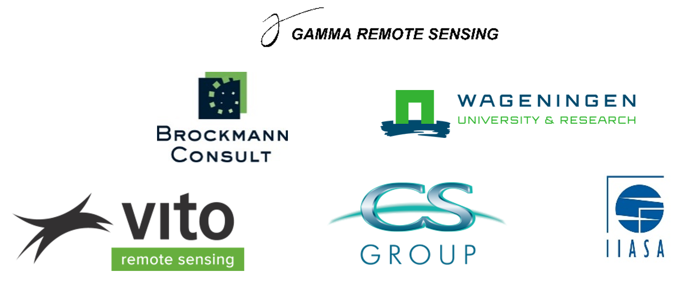
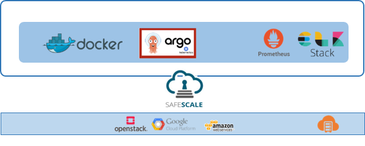

> __Customer__\: European Space Agency (ESA)

> __Programme__\: Copernicus

> __Supply Chain__\: ESA >  CS Group PDA

# Context

CS Group responsabilities are as follows:
* Design
* Development
* Integration 
* Open source promoter

The features are as follows:
* Produce, deliver and validate a global 10 meters land cover map of the world.
* Use a mapping of a minimum of 10 land cover classes and a minimum overall accuracy of 75%.
* Use innovative approaches that best exploit the novel observational capabilities of both Sentinel-1 and Sentinel-2 data at an acceptable cost.

# Project implementation

The project objectives are as follows:
* The project aims at developing an automated user-driven workflow capable of producing a global land cover maps in fast delivery.
* To meet such a challenge, production delivery is divided into 3 phases:
	* Producing 1% of the world
	* Producing 10% of the world
	* Producing 100% of the world

The processes for carrying out the project are:
* Agile
* Continuous integration

# Technical characteristics

The solution key points are as follows:
* On-demand computing platform creation service 
* Useful service deployments without the complexity of managing a processing platform over a cloud infrastructure

The main technologies used in this project are:

{:class="table table-bordered table-dark"}
| Domain | Technology(ies) |
|--------|----------------|
|Hardware environment(s)|Cloud|
|Operating System(s)|Linux|
|Programming language(s)|Go, Python|
|Production software (IDE, DEVOPS etc.)|JIRA, Docker|
|Main COTS library(ies)|Stack ELK, Kubernetes, Argo, SafeScale, S1 pre-processing, S2-preprocessing, Classification|

{::comment}Abbreviations{:/comment}

*[CLI]: Command Line Interface
*[IaC]: Infrastructure as Code
*[PaaS]: Platform as a Service
*[VM]: Virtual Machine
*[OS]: Operating System
*[IAM]: Identity and Access Management
*[SIEM]: Security Information and Event Management
*[SSO]: Single Sign On
*[IDS]: intrusion detection
*[IPS]: intrusion prevention
*[NSM]: network security monitoring
*[DRMAA]: Distributed Resource Management Application API is a high-level Open Grid Forum API specification for the submission and control of jobs to a Distributed Resource Management (DRM) system, such as a Cluster or Grid computing infrastructure.
