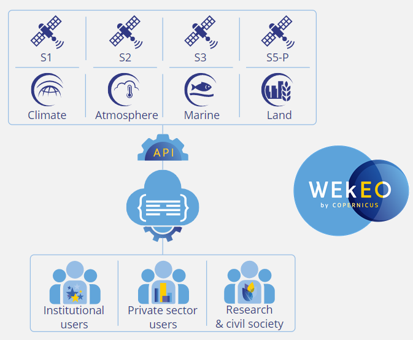

> __Customer__\: EUMETSAT

> __Program__\: Copernicus

> __Supply Chain__\: EUMETSAT >  CS Group PDA

# Context

CS Group responsabilities are as follow:
* Service development and implementation with our consortium partner SpaceTec Partners. 
* Service management
* Level-1 and -2 Sentinel-1/-2 user support
* Participation in communication and training activities

The features are as follow:
* Ticketing management system at core of a User Support Tool
* Decentralised network of experts connected to a Helpdesk through a User Support Tool
* Handle diverse user requests (from basic to advanced questions and issues)
* Fast-track response channel available for blocking incidents (e.g., ICT issue)
* Provision of guidance and communication materials

# Project implementation

The project objectives are as follow:
* Facilitate handling of Copernicus data and services
* Provide WEkEO DIAS users with online thematic and technical support
* Contribute to WEkEO’s outreach activities

The processes for carrying out the project are:
* Iterative development

# Technical characteristics

The solution key points are as follow:
* Open source solutions
* Built on Redmine project management web application 
* Deep Redmine parameterizing
* Plugin integration
* Plugin development

The main technologies are as follow.

{:class="table table-bordered table-dark"}
| Domain | Technologie(s) |
|--------|----------------|
|Operating System(s)|Linux|
|Programming language(s)|Ruby, Bash|
|Production software (IDE, DEVOPS etc.)|Docker, Docker-compose, Rocket.Chat|
|Main COTS library(ies)|Redmine 4.1, Rails, PostgreSQL|

{::comment}Abbreviations{:/comment}

*[CLI]: Command Line Interface
*[IaC]: Infrastructure as Code
*[PaaS]: Platform as a Service
*[VM]: Virtual Machine
*[OS]: Operating System
*[IAM]: Identity and Access Management
*[SIEM]: Security Information and Event Management
*[SSO]: Single Sign On
*[IDS]: intrusion detection
*[IPS]: intrusion prevention
*[NSM]: network security monitoring
*[DRMAA]: Distributed Resource Management Application API is a high-level Open Grid Forum API specification for the submission and control of jobs to a Distributed Resource Management (DRM) system, such as a Cluster or Grid computing infrastructure.
