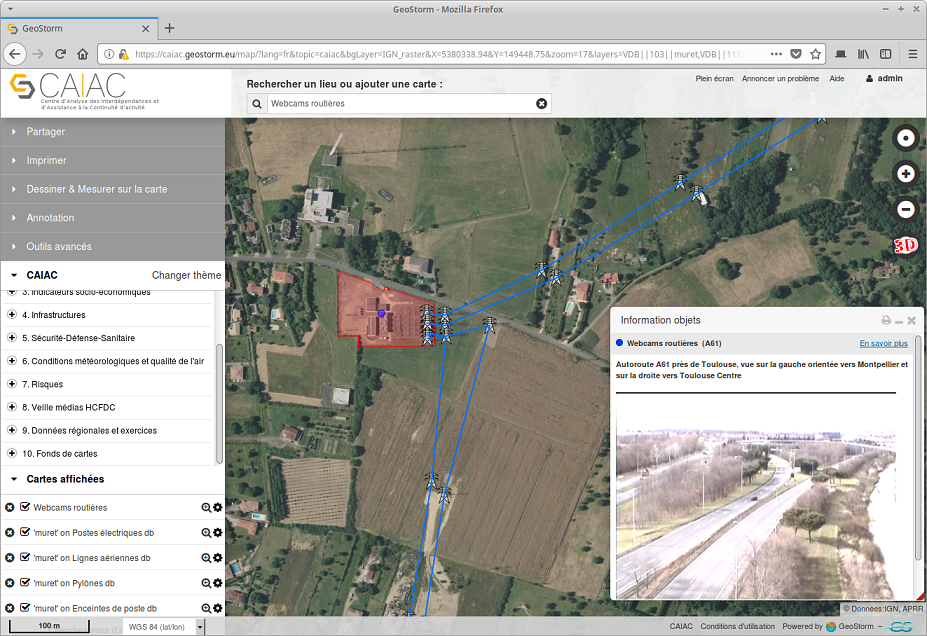

> __Customer__\: Haut Comité Français Défense Civile (HCFDC)

> __Program__\: Risk Management

> __Supply Chain__\: HCFDC >  CS Group PDA

# Context

CS Group responsabilities are as follow:
* Provision in SaaS mode of a turnkey solution. 
* Ergonomics studied for non-specialists. 
* Support services included.

The features are as follow:
* 300 data layers
* Annotation, comparison, layer measurements
* Full text search
* Visualization of the raster, vector layers
* Real-time data visualization 
* Storage and management of multidimensional data
* Integration of spatial-temporal data 
* Publication of maps
* Product distribution
* Import of external services
* Cataloguing, harvesting

# Project implementation

The project objectives are as follow:
* Deploy a mapping platform to assist critical operators and territorial managers in their planning, decision support, risk and crisis management activities. 
* Integrate simulation and information acquisition functions and services into the CAIAC platform

The processes for carrying out the project are:
* Software V-Model

# Technical characteristics

The solution key points are as follow:
* Full web solution hosted on a sovereign cloud (OVH)
* Definition of standards for module input and output
* Architecture of the service bus type
* Scalability and potential for integration of new services
* High reuse of a powerful and extensible base (GEOSTORM).

The main technologies are as follow.

{:class="table table-bordered table-dark"}
| Domain | Technologie(s) |
|--------|----------------|
|Operating System(s)|Linux, WEB client|
|Programming language(s)|HTML5, Javascript, Python|
|Interoperability (protocols, format, APIs)|WMS, WFS, WMTS, WPS, CSW, BPMN, UML, LDAP, ISO 119115, 19139, Opensearch|
|Production software (IDE, DEVOPS etc.)|Git, Docker, Jenkins|
|Main COTS library(ies)|GEOSTORM, Angular JS 1.2.x, OpenLayers 3, Django, DRF, QuantumGIS, WebGL, Postgresql 9.x, Postgis, Elastic search|

{::comment}Abbreviations{:/comment}

*[CLI]: Command Line Interface
*[IaC]: Infrastructure as Code
*[PaaS]: Platform as a Service
*[VM]: Virtual Machine
*[OS]: Operating System
*[IAM]: Identity and Access Management
*[SIEM]: Security Information and Event Management
*[SSO]: Single Sign On
*[IDS]: intrusion detection
*[IPS]: intrusion prevention
*[NSM]: network security monitoring
*[DRMAA]: Distributed Resource Management Application API is a high-level Open Grid Forum API specification for the submission and control of jobs to a Distributed Resource Management (DRM) system, such as a Cluster or Grid computing infrastructure.
