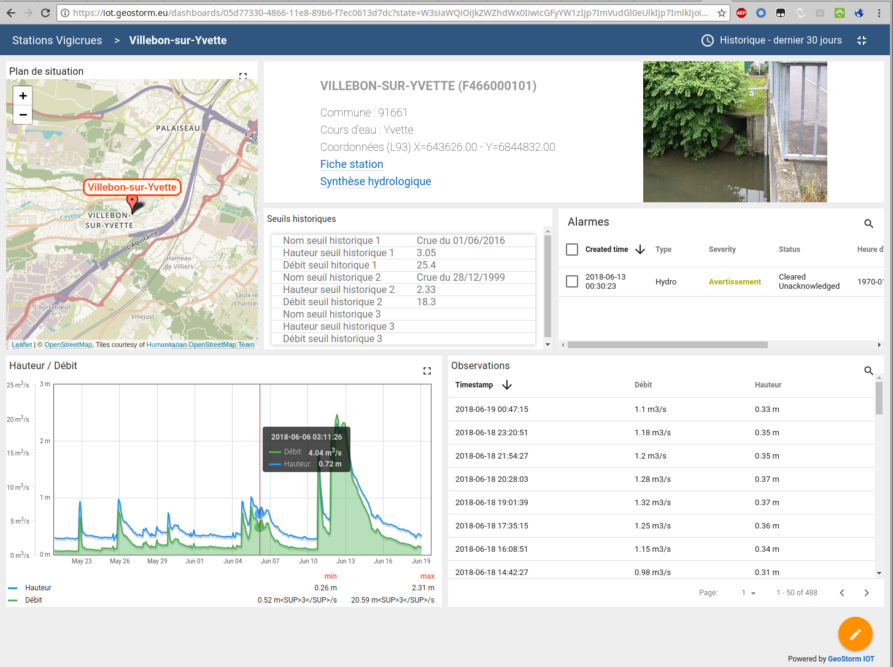
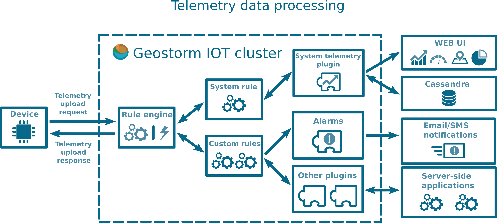

> __Customer__\: MÉTROPOLE DE NÎMES

> __Programme__\: Risk Management

> __Supply Chain__\: MÉTROPOLE DE NÎMES >  CS Group PDA

# Context

Continuing this work in the field of flood warning systems, CS SI is expanding its field of application and has acquired a new sensor supervision tool to offer a more flexible platform to its customers.
More broadly, supervision is nowadays present in most companies and communities, regardless of their size. It makes it possible to check the state of proper functioning of systems or activities of a computer system.
The IOTSTORM platform is the result of this reflection, and is designed to manage the enormous quantities of data produced by the IIOT (Industrial IOT - Internet of Industrial Objects).
A major objective of this type of platform, particularly in the field of flood warning, is to be able to warn the personnel in charge of monitoring as quickly as possible so that they can take the necessary actions. 
The public IOT standard is now the MQTT, but in the industrial field, each supplier has today its own protocol, even if standardisation is underway. IoTSTORM supports the OPC-UA.
IotStorm is designed to manage very large volumes of space-time series produced by the IOT:
* Connected sensors
* Environmental data
* GPS positions
* Webcams

CS Group responsabilities are as follows:
* Collection of need
* Specification, development, testing, deployment
* Operational maintenance

The features are as follows:
* Event management: alarms are raised as soon as the telemetry is received when certain criteria are exceeded (thresholds, slope, etc.). 
* Notification: sending alarms (mail, sms, voice) to operators and alerting others in case of no response.
* Configurable dashboards and portal integration
* Ergonomics: the HMI is intuitive and can be used by non-computer specialists.
* API for IOT data ingestion and consultation
* Maintainability: the solution is configurable and extensible.

# Project implementation

The project objectives are as follows:
* Supervision is in place in most businesses and communities, regardless of their size. 
* It verifies the proper functioning of the systems or activities of a computer system.
* The IoTSTORM platform is designed to manage the huge quantities of data produced by the IIOT.

The processes for carrying out the project are:
* V-cycle
* Continuous integration

# Technical characteristics

The solution key points are as follows:
* Service-Oriented Architecture (SOA)
* Programming by Actor (Akka framework) favouring the developemnt of competitive, scalable and robust applications.
* Several databases are supported, including Cassandra for its performance and time series management.

The main technologies used in this project are:

{:class="table table-bordered table-dark"}
| Domain | Technology(ies) |
|--------|----------------|
|Hardware environment(s)|PC|
|Operating System(s)|linux|
|Programming language(s)|Java, Javascript|
|Interoperability (protocols, format, APIs)|OPC-UA|
|Main COTS library(ies)|Spring, Cassandra, RabbitMQ, Kafka, Angular, Material Design, Akka framework|

{::comment}Abbreviations{:/comment}

*[CLI]: Command Line Interface
*[IaC]: Infrastructure as Code
*[PaaS]: Platform as a Service
*[VM]: Virtual Machine
*[OS]: Operating System
*[IAM]: Identity and Access Management
*[SIEM]: Security Information and Event Management
*[SSO]: Single Sign On
*[IDS]: intrusion detection
*[IPS]: intrusion prevention
*[NSM]: network security monitoring
*[DRMAA]: Distributed Resource Management Application API is a high-level Open Grid Forum API specification for the submission and control of jobs to a Distributed Resource Management (DRM) system, such as a Cluster or Grid computing infrastructure.
