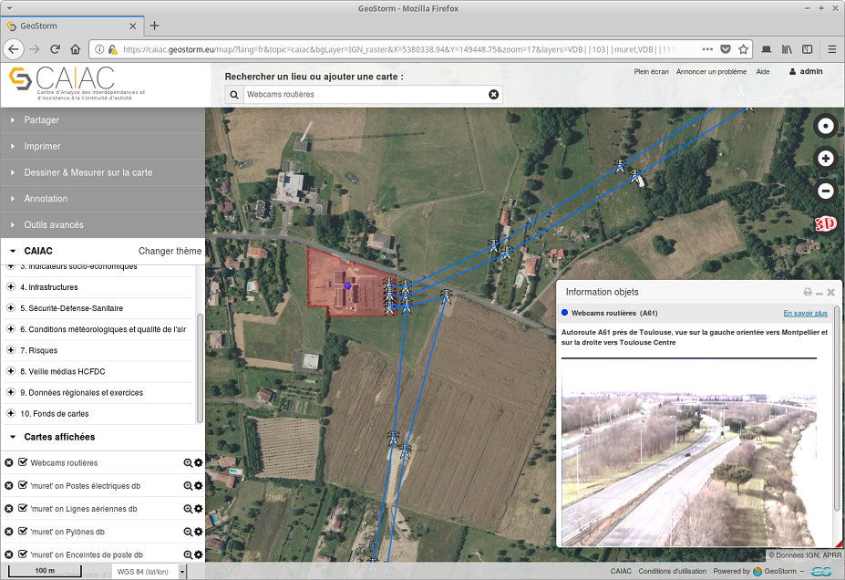

# Overview

# Context

CS Group responsabilities are as follow:
* Provision in SaaS mode of a turnkey solution. 
* Ergonomics studied for non-specialists. 
* Support services included.

The features are as follow:
* 300 data layers
* Annotation, comparison, layer measurements
* Full text search
* Visualization of the raster, vector layers
* Real-time data visualization 
* Storage and management of multidimensional data
* Integration of spatial-temporal data 
* Publication of maps
* Product distribution
* Import of external services
* Cataloguing, harvesting

# Project implementation

The project objectives are as follow:
* Deploy a mapping platform to assist critical operators and territorial managers in their planning, decision support, risk and crisis management activities. 
* Integrate simulation and information acquisition functions and services into the CAIAC platform

| Characteristic 	| Value |
|----------------	|-------|
| Start				| Thu Jan 01 01:00:00 CET 2015 |
| End				|  |
| Duration 			| Since 2015 (5,2 years) |
| Workload			| 0 men x months |

The processes for carrying out the project are:
* Software V-Model

# Technical characteristics

The solution key points are as follow:
* Full web solution hosted on a sovereign cloud (OVH)
* Definition of standards for module input and output
* Architecture of the service bus type
* Scalability and potential for integration of new services
* High reuse of a powerful and extensible base (GEOSTORM).

The main techonlogies are as follow.

COTS, Libraries: GEOSTORM, Angular JS 1.2.x, OpenLayers 3, Django, DRF, QuantumGIS, WebGL, Postgresql 9.x, Postgis, Elastic search
Software for production: Git, Docker, Jenkins
OS: Linux, WEB client
Formats & Protocols: WMS, WFS, WMTS, WPS, CSW, BPMN, UML, LDAP, ISO 119115, 19139, Opensearch
Main languages: HTML5, Javascript, Python
