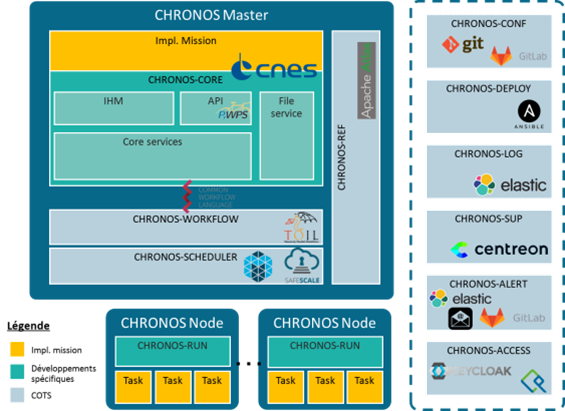

> __Customer__\: Centre National d'Etudes Spatiales (CNES)

> __Program__\: Generic

> __Supply Chain__\: CNES >  CS Group PDA

# Context

CS Group responsabilities are as follow:
* Specification & Design
* Realization of developments
* Mission Statement

The features are as follow:
* Running workflows on local, HPC or Cloud resources (no locking)
* Exploitation: 
	* Ergonomic and modern web HMI;
	* Monitoring the execution of workflows;
	* Visualization of the links between input data, processing chains and output data;
	* Alerts and acknowledgements;
	* Access to logs, execution contexts, pause/resume.
* Monitoring: HMI activity report; System status monitoring.
* Security: Management of access rights; High availability.
* Efficient: 200K tasks / day, 100M processing instances, 500M references.

# Project implementation

The project objectives are as follow:
* Design, build and commission a generic processing orchestrator for the SWOT data production centre.

The processes for carrying out the project are:
* Software V-Model, Requirement engineering, Continuous Integration

# Technical characteristics

The solution key points are as follow:
* HPC/Cloud hybridization for running processing workflows using Apache Mesos and SafeScale™
* Workflow description with CWL standard
* Integration of many COTS and in particular the TOIL workflow manager
* Micro-service architecture
* Easy to maintain: API; Extension points for HMIs; Extensible data model.

The main technologies are as follow.

{:class="table table-bordered table-dark"}
| Domain | Technologie(s) |
|--------|----------------|
|Operating System(s)|Linux RH Secure|
|Programming language(s)|Java, Python, SQL|
|Interoperability (protocols, format, APIs)|CWL, REST, AMQP, Yaml, XML|
|Production software (IDE, DEVOPS etc.)|Git|
|Main COTS library(ies)|Hibernate, JAXB, AdminLTE, GFal2, Spring, Docker, Postgresql, RabbitMQ, IPA, KeyCloack, ElasticStack, GitLab, Centreon, Toil, Apache Mesos, SafeScale, Apache Atlas, Ansible, AWX|
