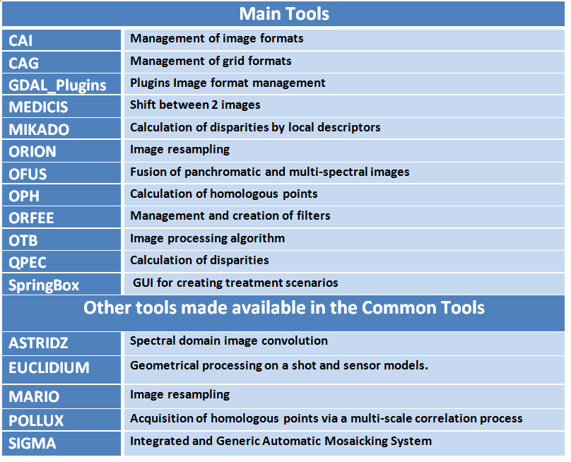

# Overview

# Context

CS Group responsabilities are as follow:
* Management of common remote sensing image processing tools (libraries, tools, processing chains).

The features are as follow:
* Provide users with common tools to carry out their work and their studies,
* Assist users to help maximise the use of this common tools for the development of their software,
* Provide these common tools on different platforms,
* Enforce quality check (validation, no regression, backward compatibility) for every tools across every platforms,
* Centralize user problems with bug tracker,
* Maintain the Orion, Qpec, Mikado, Medicis projects.

# Project implementation

The project objectives are as follow:
* Global maintenance assistance for low level image processing applications, known as CNES Common Tools

| Characteristic 	| Value |
|----------------	|-------|
| Start				| Thu Jan 01 01:00:00 CET 2009 |
| End				| Tue Jan 01 01:00:00 CET 2019 |
| Duration 			| 10,0 years |
| Workload			| 0 men x months |

The processes for carrying out the project are:
* Continuous integration over multi-platforms

# Technical characteristics

The solution key points are as follow:
* Bug Tracker  
* Code versioning

The main techonlogies are as follow.

Software for production: various client tools
License: CNES Property
OS: Windows (Cygwin), Linux 32 et 64bits (RedHat 6&7)
Main languages: C, C++, CUDA, OPENCL, python, shell
