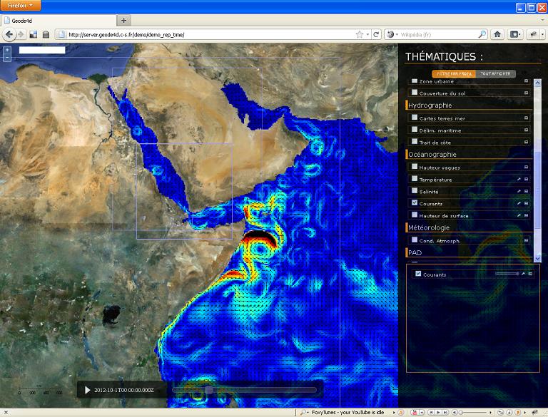

> __Customer__\: Direction Générale de l'Armement (DGA)

> __Program__\: GEODE 4D

> __Supply Chain__\: DGA >  CS Group PDA

# Context

CS Group responsabilities are as follow:
* Architectural analysis and system definition
* Functional specification, 
* Committing financial proposition, 
* Realisation of mock ups and prototypes.

The features are as follow:
* Facilitates access to relevant data
* Insures its job consistency
* Elaborates and spreads the Recognized Environmental Picture (NATO concept)
* Mutualizes the environmental data exploitation, for the whole material and human army means
* Allows to reduce costs, delays and risks for the different programs exploiting these data
* Allows to improve interoperability and exchanges of geophysical environment related information between Defence systems and provide expertize tools and decision-making helping services.

# Project implementation

The project objectives are as follow:
* GEODE 4D is a project to set up a geophysical cross forces information system.

The processes for carrying out the project are:
* Software V-Model

# Technical characteristics

The solution key points are as follow:
* Modular and generic architecture design;
* Information Systems technological experience, including each environment-dedicated domain;
* Use of tools and software worldwide known for their efficiency;
* Use of Open-Source components to reduce both ownership and exploitation costs (licences,…).

The main technologies are as follow.

{:class="table table-bordered table-dark"}
| Domain | Technologie(s) |
|--------|----------------|
|Operating System(s)|Windows seven , xp , Linux debian|
|Programming language(s)|java, python, javascript|
|Production software (IDE, DEVOPS etc.)|IBM SA, DOORS, Office 2003|
|Main COTS library(ies)|opensource GIS framework (map server, global mapper qgis, thredds...), ESRI|
