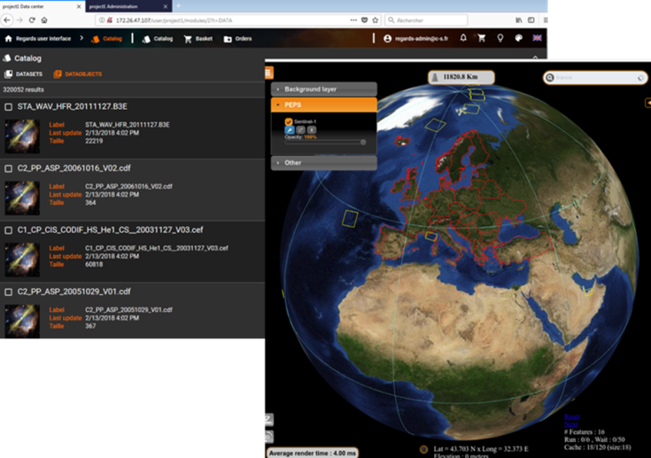
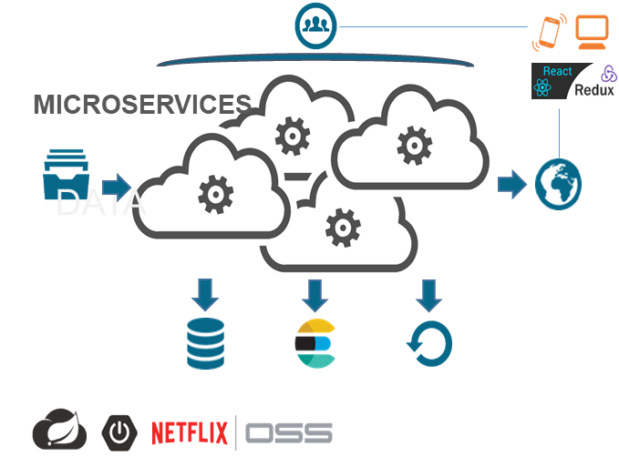

> __Customer__\: Centre National d'Etudes Spatiales (CNES)

> __Program__\: Generic

> __Supply Chain__\: CNES >  CS Group PDA

# Context

CS Group responsabilities are as follow:
* Design, Development, Integration, Maintenance
* Open source promoter

The features are as follow:
* Efficient integration of data and __metadata__
* Enrichment and valorization to scientific community: standard __interoperability__ protocols, __advanced search__ interface displays
* __Sustainable__ archiving
* Advanced administration and monitoring
* __Remote processing__ via standard protocols (WPS, UWS)
* High level of __adaptability__ (framework configuration, external developers plug-in)

# Project implementation

The project objectives are as follow:
* Data Preservation and valorization
* Open source system

The processes for carrying out the project are:
* Software V-Model, Requirement engineering, Continuous Integration

# Technical characteristics

The solution key points are as follow:
* Micro-service Distributed REST Architecture based on Spring platform: Spring Boot for the micro-services implementation; Spring Cloud for micro-services infrastructure management.
* Full web architecture (light client): React; JavaScript.

The main technologies are as follow.

{:class="table table-bordered table-dark"}
| Domain | Technologie(s) |
|--------|----------------|
|Hardware environment(s)|PC, VMWare HP|
|Operating System(s)|Linux Red Hat|
|Programming language(s)|Java, HTML, CSS, JavaScript, XSD, XML|
|Interoperability (protocols, format, APIs)|PAIS, XFDU, FITS, WPS, UWS|
|Production software (IDE, DEVOPS etc.)|Eclipse JEE, Netbeans, IntelliJ IDEA, Atom, UML-CS / Enterprise Architect, Git, Subversion, Apache Maven, NPM, Webpack, Jenkins, Travis CI, Fireworks, Junit, Selenium (tests IHM), Mockito, TestLink, Spring Test|
|Main COTS library(ies)|PostgreSQL, MongoDB, Mysql, Elasticsearch|
