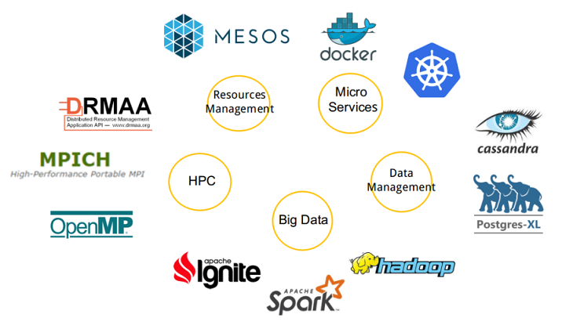

# Overview

# Context

CS Group responsabilities are as follow:
* Design, Development, Integration, Maintenance,
* Open source promoter.

The features are as follow:
* Migrating the IT architecture,
* Storage & processing chains,
* Ensuring Data & Services security,
* Ensuring data accessibility,
* Monitoring the processes.

# Project implementation

The project objectives are as follow:
* Migrating S1 Data & Payloads Digital Ground Segment Processing to cloud platforms

| Characteristic 	| Value |
|----------------	|-------|
| Start				| Tue Jan 01 01:00:00 CET 2019 |
| End				| Wed Jan 01 01:00:00 CET 2020 |
| Duration 			| 12 months |
| Workload			| 0 men x months |

The processes for carrying out the project are:
* Agile - Continuous integration

# Technical characteristics

The solution key points are as follow:
* On-demand computing platform creation service
* Useful service deployments without the complexity of managing a processing platform over a cloud infrastructure

The main techonlogies are as follow.

COTS, Libraries: Angular, SafeScale, Openstack, Kafka, PostgreSQL, IPF, MongoDB, Prometheus – Fluentd – Elasticsearch – Grafana – Kibana
Hardware: Cloud
Software for production: Docker, Gitlab, Jira, Confluence, jUnit (for Java test), Karma (for Angular test), Go test
License: Airbus DS Property
OS: Linux
Main languages: Java, Typescript, Go
