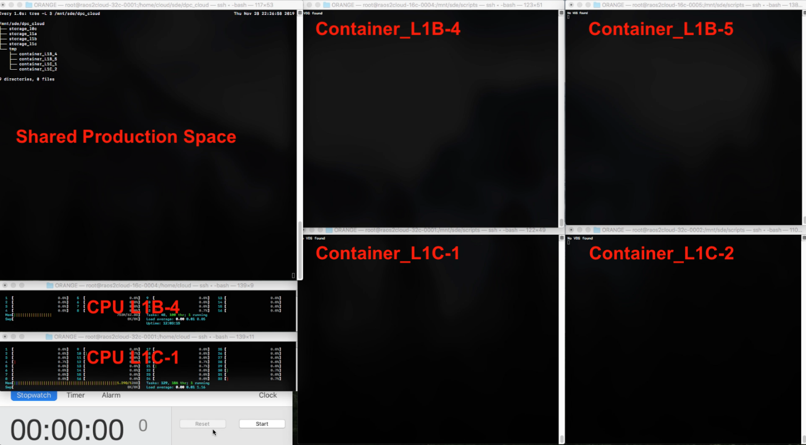
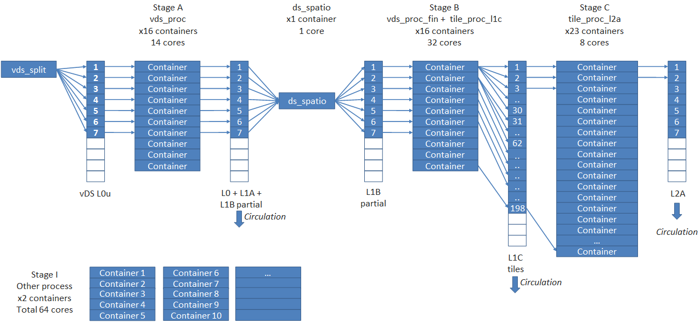

# Context

CS Group responsabilities are as follow:
* Design
* Benchmark
* Prototype Development

The features are as follow:
* Initial studies and development
* Prototype development: reads L0c DS and produces L1C vDS
* Simulation of the processing of 4-days data
* Quality impacts
* IPF Benchmarks
* Cloud provider comparison
* Performance vs price chart
* Demonstration

# Project implementation

The project objectives are as follow:
* Verify assumptions for the migration of the PDGS core processing to the cloud 
* Develop a demonstrator

The processes for carrying out the project are:
* Agile methodology

# Technical characteristics

The solution key points are as follow:
* IPFs deployed into Docker containers.
* Choreography instead of orchestration with an asynchronous messaging system.
* DS divided into smaller datastrips called vDS. Their calculation time is shorter than that of a DS.
* vDSs processed in parallel on a set of containers called "stage".

The main technologies are as follow.

{:class="table table-bordered table-dark"}
| Domain | Technologie(s) |
|--------|----------------|
|Hardware environment(s)|Orange cc3.4xlarge.4, OVH C2-60|
|Operating System(s)|Linux|
|Programming language(s)|python|
|Interoperability (protocols, format, APIs)|S2 job orders, S2 SAFE format|
|Production software (IDE, DEVOPS etc.)|Docker, S2 IPF|
