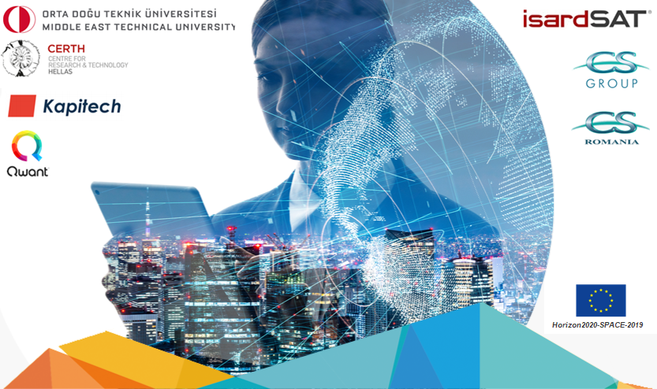
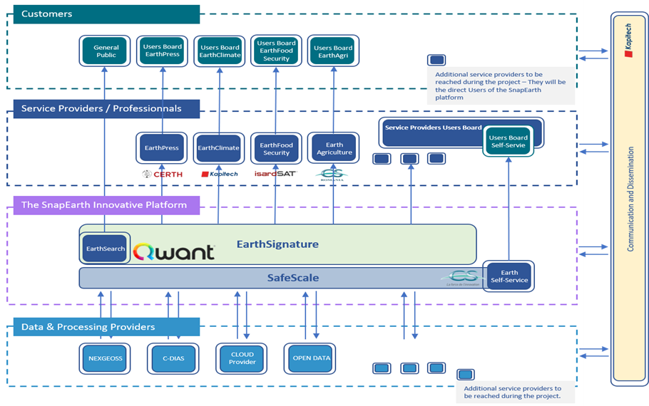

# Overview

# Context

CS Group responsabilities are as follow:
* Design, Development, Integration

The features are as follow:
* Index Sentinel images for easy access via a Qwant "EarthSearch" engine. 
* 4 pilot projects aim to take advantage of this indexing with the implementation of the services: Agriculture, Press, Climate and Food-Security. 
* The EarthSelf-Service enables any business or user to take advantage of highly scalable cloud environments for analysis, visualization and production of EO value-added services.

# Project implementation

The project objectives are as follow:
* Fostering EO market uptake thanks to natural and holistic access to added value data generated through cutting-edge Artificial Intelligence technologies.

| Characteristic 	| Value |
|----------------	|-------|
| Start				| Tue Jan 01 01:00:00 CET 2019 |
| End				|  |
| Duration 			| Since 2019 (1,2 years) |
| Workload			| 0 men x months |

The processes for carrying out the project are:
* Agile, Continuous integration

# Technical characteristics

The solution key points are as follow:
* Big data technologies and distributed cloud computing
* Access to the produced database “EarthSignature” and to satellite products
* Cloud agnosticity & multi DIAS hybridization
* Container based infrastructure with fast service deployment 
* Integrated workflow engine
* Automatic monitoring and FinOps

The main techonlogies are as follow.

COTS, Libraries: Kubernetes, Docker, Argo, EODAG, SafeScale, Elastic Stack, Fluentd, Graylog, Grafana
Hardware: Cloud, PaaS
OS: Linux
Main languages: Go, Python
